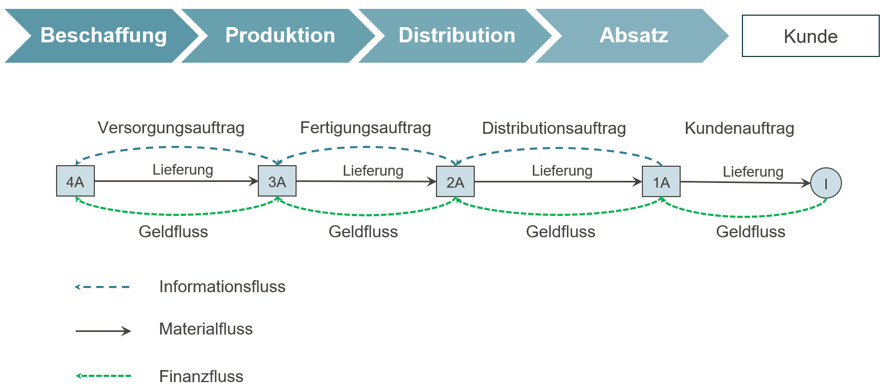
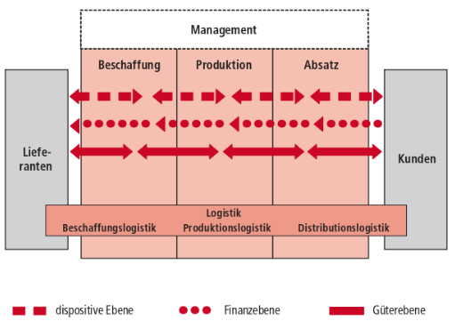
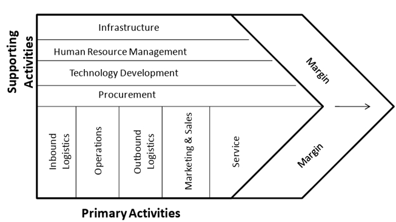
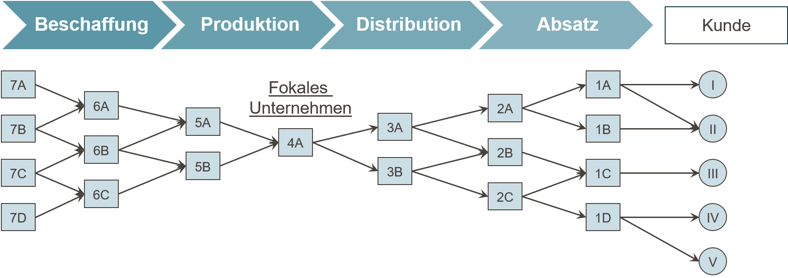
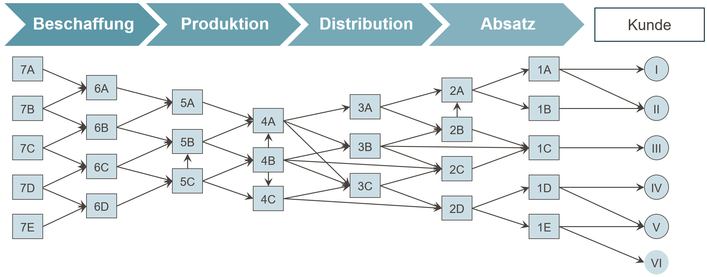

# Einführung und Grundbegriffe des Supply Chain Managements {#sec-einfuehrung}

::: {.lernziele}
**Lernziele**

- zentrale Begriffe, Akteure und Flüsse einer Supply Chain erläutern,
- Supply Chain Management gegenüber Logistik und Beschaffung abgrenzen,
- strategische, taktische und operative Entscheidungen in Supply Chains unterscheiden,
- die Bedeutung von Koordination für Wertschöpfung und Wettbewerbsfähigkeit beurteilen,
- die grundlegende Arbeitsweise von R, RStudio und Quarto nachvollziehen und einfache Vektoren, Tabellen und Grafiken selbst erstellen.
:::

## Supply Chains sind keine Erfindung der Moderne

Wer an Supply Chain Management (SCM) denkt, denkt meist zuerst an Containerschiffe, globale Werksnetze oder das Distributionssystem eines Online-Händlers. Tatsächlich ist die Koordination von Material-, Informations- und Finanzflüssen über mehrere Akteure hinweg ein uraltes Problem der Menschheitsgeschichte — nur die Werkzeuge zu seiner Lösung haben sich verändert.

Ein eindrucksvolles Beispiel liefert der Bau der Cheops-Pyramide, der um 2620 v. Chr. begann und ein Bauwerk von ursprünglich 147 Metern Höhe hervorbrachte. Für die Errichtung waren etwa 2,3 Millionen Steinblöcke mit einem Durchschnittsgewicht von 2,5 Tonnen zu gewinnen, zu transportieren und exakt zu verbauen. Das gelang nur durch koordinierten Transport, ein funktionierendes Werkzeug- und Ersatzteilmanagement sowie eine Versorgungslogistik, die täglich rund 100.000 Arbeitskräfte verpflegen musste. Ohne eine planvolle Abstimmung von Beschaffung (Steinbrüche, Werkzeuge), Transport (Nil, Schlitten, Rampen) und Verpflegung wäre ein Projekt dieser Größenordnung nicht realisierbar gewesen.

::: {layout-ncol="2"}
{fig-alt="Historische Darstellung des Pyramidenbaus"}

{fig-alt="Darstellung der Baustellenorganisation an der Cheops-Pyramide"}
:::

Ein zweites, militärisches Beispiel ist Hannibals Alpenüberquerung während des Zweiten Punischen Krieges. Sein Heer bestand unter anderem aus 37 Kriegselefanten und rund 40.000 Soldaten samt einer großen Reiterei — und musste über Hunderte Kilometer hinweg in weitgehend feindlichem Gebiet versorgt werden. Anders als bei einem stationären Bauprojekt wie der Pyramide war hier zusätzlich die Bewegung der gesamten Versorgungskette selbst eine Herausforderung: Nachschub musste dem Heer vorauseilen oder es entlang der Route erreichen, während sich Terrain, Verbündete und Gegner laufend änderten.

::: {layout-ncol="2"}
{fig-alt="Karte von Hannibals Invasionsroute nach Italien"}

{fig-alt="Darstellung der Versorgungssituation von Hannibals Heer"}
:::

Beide Beispiele zeigen bereits die Kernmerkmale, die auch moderne Supply Chains prägen: mehrere Akteure (Steinbrüche, Transportkolonnen, Verpflegungsstellen bzw. Nachschubtruppen, Verbündete), ein Zielobjekt, das über mehrere Stufen bewegt oder veredelt wird, sowie die Notwendigkeit, Mengen, Zeitpunkte und Orte so abzustimmen, dass am Ende ein Bedarf gedeckt wird. Genau diese Abstimmungsleistung — nicht der einzelne Transport oder die einzelne Fertigungsstufe — ist der Gegenstand des Supply Chain Managements.

::: {.r-exkurs}
**R-Exkurs: R, RStudio und Quarto**

Dieses Lehrbuch nutzt durchgängig die Programmiersprache **R**, eine kostenlose Open-Source-Sprache für statistische Berechnungen und Datenvisualisierung. Programmiert wird typischerweise in **RStudio**, einer Entwicklungsumgebung, die einen Editor, eine Konsole zur unmittelbaren Codeausführung und Werkzeuge zur Verwaltung von Dateien und Paketen in einem Fenster vereint.

Dieses Buch selbst ist als **Quarto**-Dokument (Dateiendung `.qmd`) geschrieben. Quarto verbindet gewöhnlichen Text (wie diesen Absatz) mit ausführbarem R-Code in sogenannten **Code-Chunks**. Ein Chunk beginnt und endet mit drei rückwärts geneigten Anführungszeichen (`` ``` ``), wobei die öffnende Zeile zusätzlich `{r}` enthält, um R als Sprache zu kennzeichnen. Beim Rendern des Dokuments wird der Code tatsächlich ausgeführt, und Ergebnisse (Zahlen, Tabellen, Grafiken) werden automatisch in den Text eingebettet — Text und Berechnung laufen also nie auseinander.

Ein minimales Beispiel:

```{r}
#| label: ch1-erste-zuweisung

# Eine Zuweisung: Der Name "anzahl_akteure" erhaelt den Wert 5
anzahl_akteure <- 5

# Wird der Name ausgewertet, gibt R den gespeicherten Wert aus
anzahl_akteure
```

Die Zeile `#| label: ch1-erste-zuweisung` ist keine Ausgabe, sondern eine **Chunk-Option**: Sie vergibt einen eindeutigen internen Namen für diesen Codeblock, was bei der Fehlersuche und beim Verweisen auf Abbildungen hilft.
:::

## Ein antikes Fallbeispiel: Die Toga praetexta

Wie stark bereits vormoderne Wertschöpfungsketten Rohstoffbeschaffung, Verarbeitung und Distribution über weite Entfernungen verknüpften, illustriert die Herstellung der *Toga praetexta*, des purpurgesäumten Gewandes römischer Amtsträger. Der Produktionsprozess begann mit der Schafhaltung und der Schur und Sortierung der Rohwolle. Die Wolle wurde zu Garn versponnen, zu weißem Wolltuch verwoben und anschließend gewalkt, gereinigt, gebleicht und zugeschnitten — ein Verarbeitungsschritt, der die Ware auf rund 100 Sesterze je Pfund verteuerte.

Parallel dazu lief eine zweite, deutlich kostspieligere Kette: die Purpurgewinnung. Aus eigens gezüchteten Purpurschnecken wurde die Hypobranchialdrüse entnommen, gesalzen und über mehrere Tage erhitzt, um daraus den namensgebenden Farbstoff zu gewinnen, mit dem Wolle oder fertige Tuchbahnen gefärbt wurden. Dieser Veredelungsschritt kostete rund 4.000 Sesterze je Pfund — vierzigmal so viel wie die reine Wollverarbeitung. Erst im letzten Schritt wurden Purpursaum und Wollgewand zur fertigen Toga konfektioniert.

Am Markt zeigte sich diese Wertschöpfungsstruktur in drastisch gestaffelten Preisen: Eine einfache weiße Toga kostete etwa 12 Sesterze, eine bessere weiße Toga rund 60 Sesterze, eine Toga praetexta hingegen 800 Sesterze — bei einem Jahressold eines einfachen Soldaten von rund 1.000 Sesterzen entsprach eine einzige Toga praetexta also fast einem Jahreseinkommen. Der Preisunterschied lässt sich fast vollständig auf den Wertschöpfungsschritt "Purpurfärbung" zurückführen, der wiederum von einer eigenen, geografisch weit gespannten Beschaffungskette abhing: Rohwolle kam unter anderem aus Tarent und Milet, der Purpurfarbstoff aus dem levantinischen Tyros, Verarbeitung und Absatz konzentrierten sich auf Rom.

::: {.definition}
**Definition: Wertschöpfungskette**

Eine **Wertschöpfungskette** ist die Abfolge von Aktivitäten, durch die ein Ausgangsstoff schrittweise so verändert wird, dass sein Wert aus Sicht des Endabnehmers steigt. Jede Stufe fügt entweder physisch Wert hinzu (Verarbeitung, Veredelung) oder verschiebt den Wert räumlich beziehungsweise zeitlich (Transport, Lagerung) [@chopra2025supply].
:::

::: {.r-exkurs}
**R-Exkurs: Zuweisung, Kommentare und Basisdatentypen**

R kennt wie die meisten Programmiersprachen benannte Speicherplätze für Werte. Ein Wert wird einem Namen mit dem **Zuweisungsoperator** `<-` zugewiesen (gesprochen "wird zugewiesen von"); alternativ funktioniert auch `=`, in R-Code ist `<-` jedoch üblich. Text nach einem Rautezeichen `#` ist ein **Kommentar** und wird von R ignoriert — Kommentare dienen ausschließlich dazu, Code für Menschen verständlich zu machen.

R unterscheidet mehrere **Basisdatentypen**. Die drei wichtigsten für den Einstieg sind:

- `numeric`: Zahlen, etwa Preise oder Mengen,
- `character`: Zeichenketten (Text), stets in Anführungszeichen,
- `logical`: Wahrheitswerte, nur `TRUE` oder `FALSE`.

```{r}
#| label: ch1-basisdatentypen

# numeric: eine Zahl -- hier der Preis einer einfachen Toga in Sesterzen
preis_einfache_toga <- 12

# character: eine Zeichenkette -- hier der Produktname
produktname <- "Toga praetexta"

# logical: ein Wahrheitswert -- handelt es sich um ein Luxusgut?
ist_luxusgut <- TRUE

# class() gibt den Datentyp eines Objekts zurueck
class(preis_einfache_toga)
class(produktname)
class(ist_luxusgut)
```
:::

::: {.r-exkurs}
**R-Exkurs: Vektoren und Vektorrechnung**

Einzelne Werte reichen selten aus, um eine ganze Produktpalette oder mehrere Supply-Chain-Stufen abzubilden. Die Funktion `c()` (für *combine*) fasst mehrere Werte zu einem **Vektor** zusammen — der grundlegenden Datenstruktur in R. Vektorelemente können über Namen adressiert werden, und Rechenoperationen werden **elementweise** ausgeführt, das heißt, jede einzelne Zahl im Vektor wird separat verarbeitet, ohne dass eine Schleife von Hand geschrieben werden muss.

```{r}
#| label: ch1-toga-preise

# c() fasst mehrere benannte Werte zu einem Vektor zusammen
toga_preise <- c(einfach = 12, besser = 60, praetexta = 800)

# Ausgabe des gesamten Vektors mit Namen
toga_preise

# Elementweise Rechnung: Aufschlagsfaktor gegenueber der einfachsten Toga
# (jedes Element von toga_preise wird durch denselben Skalar geteilt)
aufschlagsfaktor <- toga_preise / toga_preise["einfach"]
round(aufschlagsfaktor, 1)
```

Der letzte Aufruf zeigt: Eine Toga praetexta kostete rund 67-mal so viel wie das einfachste Modell — ein direktes Abbild der zusätzlichen Wertschöpfungsstufe "Purpurfärbung".
:::

## Globale Supply Chains vor der Moderne: der Gewürzhandel

Noch deutlicher als am Beispiel der Toga zeigt sich die räumliche Ausdehnung vormoderner Supply Chains im Gewürzhandel des 15. Jahrhunderts. Pfeffer wuchs praktisch ausschließlich auf den Molukken und an der Malabarküste Vorderindiens, wurde aber in ganz Europa nachgefragt. Vor 1498 verlief der Handelsweg über eine lange Kette von Umschlagsplätzen: von den Molukken über Malakka und Calicut auf dem Seeweg, von dort über Aden und das Rote Meer, per Karawane weiter über Kairo nach Alexandria und schließlich per Schiff nach Venedig, von wo aus der Weiterverkauf in die europäischen Konsumräume erfolgte. Jede dieser Stufen — Produktion, Umschlag, Zwischenhandel, Transport — erforderte eigene Akteure, eigene Transportmittel und eigene Verträge, und jede Stufe schlug einen Aufpreis auf die Ware.

Das Ergebnis war eine drastische Preissteigerung entlang der Kette: Ausgehend von einem Wert von etwa 1,5 Gramm Silberäquivalent je Kilogramm Pfeffer auf den Molukken stieg der Preis über Malakka (4 g) und Calicut (8 g) auf 12 g in Alexandria, 16 g in Venedig und schließlich rund 25 g Silber je Kilogramm in den europäischen Konsumzentren — eine Verzehnfachung, bevor die Ware überhaupt den Endverbraucher erreichte. Diese Marge lockte 1519 die von der spanischen Krone finanzierte Magellan-Expedition, die einen direkten westlichen Seeweg zu den Gewürzinseln unter Umgehung des von Venedig und arabischen Zwischenhändlern kontrollierten Landwegs suchte. Der Preis dieses Versuchs war hoch: Von den fünf Schiffen und 260 Mann Besatzung, die 1519 ausliefen, kehrte 1522 nur ein Schiff mit 18 Überlebenden zurück — wirtschaftlich war die Fahrt durch die mitgeführte Nelkenladung dennoch profitabel, ein Umstand, der die Bedeutung dieses neuen, kürzeren Versorgungswegs unterstreicht [@zweig1983magellan].

Nach 1498, mit der Umsegelung Afrikas durch Vasco da Gama, entstand eine zweite, rein seegestützte Route von Lissabon über Mosambik und Malindi direkt nach Calicut. Sie umging die zahlreichen Zwischenstufen der Karawanen- und Levante-Route und veränderte dadurch nachhaltig, welche Akteure am Gewürzhandel verdienten — ein frühes Beispiel dafür, wie eine veränderte Netzwerkstruktur die Verteilung der Wertschöpfung innerhalb einer Supply Chain verschiebt, ohne dass sich das Produkt selbst änderte.

### Die Wirtschaftlichkeit einer Supply-Chain-Innovation: die Magellan-Expedition

Die Vorlesungsfolien stellen der Preisentwicklung entlang der Gewürzroute eine zweite Grafik gegenüber: die wirtschaftliche Bilanz der Magellan-Expedition. Sie lohnt eine genauere Betrachtung, weil sie ein Grundmuster jeder Netzwerkentscheidung zeigt, das uns in den Kapiteln zur Standortplanung wiederbegegnen wird: Einer **hohen, sicheren Anfangsinvestition** (Schiffe, Ausrüstung, Proviant, Heuer, Tauschwaren) steht ein **unsicherer, zeitlich weit entfernter Rückfluss** gegenüber (der Erlös der Gewürzladung). Die Kosten- und Erlöspositionen sind in der Rechnungswährung der spanischen Krone, dem *Maravedí*, überliefert [@zweig1983magellan]. Um sie mit den Preisangaben der Gewürzroute vergleichbar zu machen, werden sie in Silberäquivalente umgerechnet (rund 3,195 g Silber je 34 Maravedís):

```{r}
#| label: ch1-magellan-bilanz
#| fig-cap: "Wirtschaftliche Bilanz der Magellan-Expedition in kg Silberäquivalent (Wasserfalldiagramm)"

library(tidyverse)

silber_je_maravedi <- 3.195 / 34   # g Silber je Maravedi

magellan <- tribble(
  ~position,                                     ~maravedis,
  "Schiffe, Takelage, Artillerie, Bewaffnung",   -3912241,
  "Proviant und Fässer",                         -1585551,
  "Heuer für 237 Personen",                      -1154504,
  "Tausch- und Handelswaren",                    -1679769,
  "Sonstiger Bedarf",                             -415060,
  "Erlös der Nelkenladung",                       7888684,
  "Weitere Waren",                                1000000
) |>
  mutate(
    silber_kg = maravedis * silber_je_maravedi / 1000,  # Umrechnung in kg Silber
    typ       = if_else(silber_kg < 0, "Kosten", "Erlös"),
    ende      = cumsum(silber_kg),                       # kumulierter Saldo
    anfang    = lag(ende, default = 0),
    nr        = row_number()
  )

# Wasserfalldiagramm: jedes Rechteck beginnt dort, wo das vorige endet
ggplot(magellan) +
  geom_rect(aes(xmin = nr - 0.4, xmax = nr + 0.4,
                ymin = pmin(anfang, ende), ymax = pmax(anfang, ende), fill = typ)) +
  geom_hline(yintercept = 0, colour = "grey40") +
  scale_x_continuous(breaks = magellan$nr, labels = magellan$position) +
  scale_fill_manual(values = c(Kosten = "#b2182b", "Erlös" = "#1b7837")) +
  labs(x = NULL, y = "kg Silberäquivalent", fill = NULL) +
  theme_minimal(base_size = 11) +
  theme(axis.text.x = element_text(angle = 30, hjust = 1))

# Saldo der Expedition in kg Silber
round(sum(magellan$silber_kg), 1)
```

Den Kosten von rund `r round(-sum(magellan$silber_kg[magellan$silber_kg < 0]), 0)` kg Silber standen Erlöse von rund `r round(sum(magellan$silber_kg[magellan$silber_kg > 0]), 0)` kg Silber gegenüber — trotz des Verlusts von vier der fünf Schiffe blieb also ein knapper Überschuss. Die Rechnung macht zweierlei deutlich. Erstens: Der Wert der Ladung — gut 20 Tonnen Gewürznelken — war so hoch, dass selbst ein einziges zurückkehrendes Schiff die gesamte Expedition refinanzierte. Die gewaltige Preisspanne zwischen Molukken und Europa (siehe oben) ist die ökonomische Ursache dafür. Zweitens: Die Bilanz war extrem riskant. Wäre auch das letzte Schiff verloren gegangen, hätten den Kosten keinerlei Erlöse gegenübergestanden. Hohe Margen entlang einer Supply Chain sind deshalb nicht nur Ausdruck von Marktmacht, sondern häufig auch eine **Risikoprämie** für Akteure, die Transport-, Verderbs- und Ausfallrisiken tragen — ein Gedanke, der in Kapitel [-@sec-strategic-fit] (Risikoallokation) und in den Kapiteln zur Unsicherheit (Kapitel [-@sec-unsicherheit-pooling] bis [-@sec-bullwhip]) wieder aufgegriffen wird.

::: {.r-exkurs}
**R-Exkurs: `data.frame` und `tibble` als Tabellenstruktur**

Ein Vektor bildet nur eine einzelne Größe ab. Für Daten mit mehreren zusammengehörigen Variablen — etwa "Handelsstufe" und "Preis" — wird eine **Tabellenstruktur** benötigt, in der jede Zeile eine Beobachtung (hier: eine Stufe der Handelsroute) und jede Spalte eine Variable darstellt. In Basis-R heißt diese Struktur `data.frame`; im sogenannten **tidyverse** (siehe nächster Exkurs) existiert mit `tibble` eine modernisierte Variante mit übersichtlicherer Druckausgabe.

```{r}
#| label: ch1-gewuerzhandel-tabelle

# data.frame(): eine Tabelle aus gleich langen, benannten Spaltenvektoren
gewuerzhandel <- data.frame(
  stufe = c("Molukken", "Malakka", "Calicut", "Alexandria", "Venedig", "Europa"),
  preis_silber_pro_kg = c(1.5, 4, 8, 12, 16, 25)
)

# str() zeigt die Struktur: 6 Beobachtungen (Zeilen), 2 Variablen (Spalten)
str(gewuerzhandel)

gewuerzhandel
```
:::

::: {.r-exkurs}
**R-Exkurs: Pakete laden mit `library()`**

Der Funktionsumfang von R lässt sich durch **Pakete** (*packages*) erweitern — Sammlungen zusätzlicher Funktionen, die von der R-Gemeinschaft bereitgestellt werden. Ein Paket muss einmalig mit `install.packages("paketname")` installiert, aber in **jeder neuen R-Sitzung** erneut mit `library(paketname)` geladen werden, bevor seine Funktionen genutzt werden können.

Dieses Buch verwendet durchgängig das **tidyverse**, ein Bündel von Paketen für Datenmanipulation (u. a. `dplyr`, das Paket für `tibble`) und Visualisierung (`ggplot2`).

```{r}
#| label: ch1-library-tidyverse
#| message: false
#| warning: false

# library() laedt ein zuvor installiertes Paket in die aktuelle Sitzung.
# tidyverse buendelt u.a. dplyr (Datenmanipulation) und ggplot2 (Grafik).
library(tidyverse)
```
:::

Mit geladenem tidyverse lässt sich dieselbe Tabelle als `tibble` anlegen. Der zusätzliche Schritt, die Spalte `stufe` als **Faktor** mit fester Reihenfolge zu definieren, sorgt dafür, dass die Handelsroute später in der richtigen chronologischen Abfolge dargestellt wird und nicht alphabetisch sortiert erscheint.

```{r}
#| label: ch1-gewuerzhandel-tibble

# tibble() ist die tidyverse-Variante von data.frame()
# factor(..., levels = ...) legt eine feste Kategorien-Reihenfolge fest,
# statt R die (unerwuenschte) alphabetische Sortierung ueberlassen
reihenfolge_stufen <- c("Molukken", "Malakka", "Calicut",
                         "Alexandria", "Venedig", "Europa")

gewuerzhandel_tbl <- tibble(
  stufe = factor(reihenfolge_stufen, levels = reihenfolge_stufen),
  preis_silber_pro_kg = c(1.5, 4, 8, 12, 16, 25)
)

gewuerzhandel_tbl
```

::: {.r-exkurs}
**R-Exkurs: Die erste `ggplot()`-Grafik**

Das Paket `ggplot2` folgt der sogenannten **Grammar of Graphics**: Eine Grafik entsteht aus drei Bausteinen, die additiv mit `+` verknüpft werden.

1. `data`: der Datensatz, der die darzustellenden Werte enthält,
2. `aes()` (*aesthetic mapping*): die Zuordnung von Tabellenspalten zu visuellen Eigenschaften wie x-Achse, y-Achse oder Farbe,
3. `geom_*()`: die geometrische Darstellungsform, z. B. `geom_col()` für Balken oder `geom_line()` für Linien.

```{r}
#| label: ch1-ggplot-gewuerzhandel
#| fig-cap: "Preissteigerung von Pfeffer entlang der vorkolonialen Handelsroute (vor 1498)"

# ggplot(): data + aes() legen Datensatz und Achsenzuordnung fest,
# geom_col() waehlt Saeulen als geometrische Darstellungsform
ggplot(data = gewuerzhandel_tbl, aes(x = stufe, y = preis_silber_pro_kg)) +
  geom_col(fill = "#2D6A4F") +
  labs(
    x = NULL,
    y = "g Silber je kg Pfeffer",
    title = "Wertschoepfung entlang der Gewuerzhandelsroute"
  ) +
  theme_minimal(base_size = 12)
```

Jede zusätzliche Handelsstufe erhöht den Preis sichtbar — die Grafik macht damit auf einen Blick nachvollziehbar, was der Fließtext zuvor in Zahlen beschrieben hat.
:::

## Was ist eine Supply Chain? Begriffsbestimmung

Die historischen Beispiele lassen bereits ein gemeinsames Muster erkennen: Mehrere rechtlich und wirtschaftlich selbstständige Akteure sind über physische, informatorische und finanzielle Beziehungen so miteinander verbunden, dass am Ende ein Bedarf gedeckt wird, den kein einzelner Akteur allein hätte decken können.

::: {.definition}
**Definition: Supply Chain**

Eine **Supply Chain** (Wertschöpfungs- oder Lieferkette) umfasst alle Parteien, die direkt oder indirekt daran beteiligt sind, eine Kundenanfrage zu erfüllen — von Rohstofflieferanten über Hersteller und Transporteure bis zu Groß- und Einzelhändlern sowie den Kunden selbst. Innerhalb jedes Unternehmens schließt die Supply Chain zudem alle Funktionen ein, die eine Kundenanfrage empfangen und erfüllen, etwa Produktentwicklung, Marketing, Produktion, Distribution, Finanzen und Kundendienst [@chopra2025supply].
:::

Zentral ist dabei, dass eine Supply Chain **kein linearer Prozess**, sondern ein Netzwerk ist: Ein Hersteller bezieht in der Regel von mehreren Lieferanten und beliefert mehrere Distributionskanäle; jeder dieser Partner ist wiederum selbst Teil weiterer Supply Chains. Innerhalb dieses Netzwerks lassen sich drei Arten von Flüssen unterscheiden, die in entgegengesetzte oder parallele Richtungen verlaufen:

- der **Materialfluss** (auch Güterfluss): die physische Bewegung von Rohstoffen, Halb- und Fertigerzeugnissen stromabwärts, vom Ursprung zum Endkunden,
- der **Finanzfluss**: Zahlungen, die in der Regel stromaufwärts fließen, sobald eine Leistung erbracht wurde, sowie damit verbundene Bestands- und Kapitalbindungseffekte,
- der **Informationsfluss**: Bedarfsprognosen, Bestellungen, Statusmeldungen und Planungsdaten, die in beide Richtungen fließen und die Abstimmung der beiden anderen Flüsse überhaupt erst ermöglichen.

{fig-align="center" width="80%"}

Diese Dreiteilung lässt sich unmittelbar auf die Ebenen im Unternehmen selbst übertragen, wenn man ein Unternehmen als offenes System begreift, das mit seiner Umwelt sowohl Güter als auch Informationen und Zahlungen austauscht [@kummer2018grundzuge]:

- Die **dispositive Ebene** behandelt den Informationsfluss im und zwischen Unternehmen sowie die damit verbundenen Planungs-, Entscheidungs- und Kontrollprozesse (Management im engeren Sinn).
- Die **Finanzebene** erfasst Geld- und Zahlungsströme innerhalb und außerhalb des Unternehmens.
- Die **Güterebene** erfasst Bewegung und Bestand physischer Güter — Roh-, Hilfs- und Betriebsstoffe ebenso wie fertige Produkte — innerhalb und zwischen Unternehmen.

{fig-align="center" width="70%"}

Diese drei Ebenen sind nicht unabhängig voneinander: Eine Entscheidung auf der dispositiven Ebene (z. B. eine Bestellauslösung) erzeugt sowohl einen zukünftigen Güterfluss als auch einen zukünftigen Zahlungsfluss. Genau diese Verzahnung macht die Koordination über Unternehmensgrenzen hinweg zur zentralen Managementaufgabe, die im weiteren Verlauf dieses Buches als Supply Chain Management bezeichnet wird.

## Wertschöpfung und Kundennutzen in der Supply Chain

Aus Sicht des Endkunden ist ein Produkt erst dann wertvoll, wenn es am richtigen Ort, zur richtigen Zeit, in der richtigen Form und mit vollständiger Verfügungsgewalt zur Verfügung steht. Betriebswirtschaftlich lässt sich dieser Kundennutzen in mehrere Nutzenarten zerlegen, die jeweils durch bestimmte Supply-Chain-Funktionen erzeugt werden:

- **Formnutzen** (*utility by design*): entsteht durch Produktion — das physische Umwandeln von Rohstoffen und Vorprodukten in ein Gut, das die Bedürfnisse des Kunden erfüllt.
- **Informationsnutzen** (*utility by information*): entsteht dadurch, dass Kunden und Anbieter wissen, was, wann und in welcher Qualität verfügbar ist.
- **Raumnutzen** (*utility by location*): entsteht durch Transport — ein Gut, das nicht am Ort der Nachfrage verfügbar ist, stiftet keinen Nutzen.
- **Zeitnutzen** (*utility by time*): entsteht durch Lagerung und termingerechte Bereitstellung — ein Gut, das zu früh oder zu spät verfügbar ist, verfehlt seinen Zweck ebenso.
- **Verfügungsnutzen** (*utility by property*): entsteht durch den rechtlichen und physischen Übergang der Verfügungsgewalt vom Anbieter zum Nachfrager im Rahmen des Konsums.

Diese Nutzenarten entstehen entlang der klassischen betrieblichen Grundfunktionen Beschaffung, Produktion, Distribution und Konsum: Beschaffung und Produktion tragen primär zum Formnutzen bei, Distribution zu Raum-, Zeit- und Informationsnutzen, und der Konsum realisiert schließlich den Verfügungsnutzen als Bedürfnisbefriedigung. Die **Logistik** ist dabei die Funktion, die gezielt Raum- und Zeitnutzen erzeugt — und damit eine Querschnittsfunktion, die alle Stufen der Supply Chain miteinander verbindet, ohne selbst eine eigene Wertschöpfungsstufe im engeren Sinn zu sein.

Innerbetrieblich lässt sich diese Querschnittsfunktion weiter untergliedern in **Beschaffungslogistik** (Warenanlieferung vom Lieferanten bis ins Werk), **Produktionslogistik** (innerbetrieblicher Materialfluss zwischen Fertigungsstufen), **Distributionslogistik** (Warenausgang bis zum Kunden) und **Entsorgungslogistik** (Rückführung von Verpackungen, Retouren und Reststoffen).

{fig-align="center" width="75%"}

Der Blick auf Nutzenarten lässt sich mit dem klassischen Konzept der **Wertkette** (*value chain*) nach Michael Porter verknüpfen. Porter unterscheidet **primäre Aktivitäten**, die direkt zur Herstellung, zum Verkauf und zur Lieferung eines Produkts beitragen (Eingangslogistik, Produktion, Ausgangslogistik, Marketing & Vertrieb, Kundendienst), von **unterstützenden Aktivitäten**, die diese primären Aktivitäten erst ermöglichen (Unternehmensinfrastruktur, Personalmanagement, Technologieentwicklung, Beschaffung). Supply Chain Management lässt sich damit auch als der Versuch verstehen, die primären Aktivitäten der Wertkette nicht nur innerhalb eines Unternehmens, sondern über mehrere rechtlich selbstständige Wertketten hinweg zu koordinieren.

::: {layout-ncol="2"}
{fig-alt="Porters Wertkettenmodell mit primären und unterstützenden Aktivitäten"}

{fig-alt="Verkettete Wertketten mehrerer Supply-Chain-Partner"}
:::

Aus dieser Perspektive lässt sich der wirtschaftliche Erfolg einer Supply Chain formal fassen. Der **SCM-Gewinn** ergibt sich als Differenz aus dem beim Endkunden erzielten Umsatz und den Gesamtkosten aller beteiligten Prozesse und Partner:

$$
\text{SCM-Gewinn} = \text{Kundenumsatz} - \text{Gesamtkosten aller Prozesse und Partner}
$$

Dieser SCM-Gewinn ist zugleich die Summe der individuellen Gewinne aller beteiligten Akteure. Daraus folgt eine zentrale, oft unterschätzte Erkenntnis: **Die Optimierung der individuellen Gewinne einzelner Akteure führt in der Regel nicht zur Optimierung des SCM-Gewinns.** Ein Lieferant, der seinen eigenen Gewinn maximiert, indem er große Losgrößen produziert, kann beim Abnehmer hohe Lagerkosten und Kapitalbindung verursachen, die den Gesamtgewinn der Kette schmälern. Genau diese Diskrepanz zwischen individueller und gesamthafter Optimierung begründet den eigenständigen Koordinationsbedarf, den Supply Chain Management adressiert — ein Thema, das in späteren Kapiteln dieses Buches, etwa beim Bullwhip-Effekt, wieder aufgegriffen wird.

::: {.vertiefung}
**Theorie-Vertiefung: Doppelte Marginalisierung — warum lokale Gewinnmaximierung den SCM-Gewinn senkt**

Die Folienaussage "Optimierung der individuellen Gewinne führt i. d. R. nicht zur Optimierung des SCM-Gewinns" lässt sich an einem klassischen mikroökonomischen Modell präzise zeigen, der **doppelten Marginalisierung** [@spengler1950vertical]. Betrachtet wird eine zweistufige Kette aus Hersteller und Händler. Der Hersteller produziert zu Stückkosten $c$ und verkauft an den Händler zum Großhandelspreis $w$; der Händler setzt den Endkundenpreis $p$. Die Endkundennachfrage sei linear, $q = a - p$.

*Integrierte Kette (ein Entscheider):* Maximiert wird der gesamte Kettengewinn $(p - c)\,q = (a - q - c)\,q$. Die Bedingung erster Ordnung $a - 2q - c = 0$ liefert $q^{I} = (a-c)/2$ und einen Kettengewinn von $(a-c)^2/4$.

*Dezentrale Kette (jeder optimiert für sich):* Der Händler maximiert $(a - q - w)\,q$ und wählt $q = (a-w)/2$. Der Hersteller antizipiert diese Reaktion und maximiert $(w-c)\,(a-w)/2$, woraus $w = (a+c)/2$ folgt. Eingesetzt ergibt sich $q^{D} = (a-c)/4$ — **nur die Hälfte** der integrierten Menge. Beide Stufen schlagen nacheinander einen eigenen Aufschlag ("Marge") auf, der Endkundenpreis steigt, die Absatzmenge sinkt, und der Kettengewinn fällt auf $3(a-c)^2/16$, also auf 75 % des möglichen Wertes.

```{r}
#| label: ch1-doppelte-marginalisierung

a <- 100   # Marktgröße (Prohibitivpreis)
k <- 20    # Stückkosten des Herstellers (nicht "c" nennen: c() ist die R-Funktion zum Kombinieren)

# Integrierte Kette
q_int     <- (a - k) / 2
gewinn_int <- (a - q_int - k) * q_int

# Dezentrale Kette: Hersteller setzt w, Händler reagiert
w_dez      <- (a + k) / 2
q_dez      <- (a - w_dez) / 2
p_dez      <- a - q_dez
gewinn_haendler   <- (p_dez - w_dez) * q_dez
gewinn_hersteller <- (w_dez - k) * q_dez

tibble(
  Kennzahl  = c("Menge", "Endkundenpreis", "Gewinn Hersteller", "Gewinn Händler", "SCM-Gewinn"),
  Integriert = c(q_int, a - q_int, NA, NA, gewinn_int),
  Dezentral  = c(q_dez, p_dez, gewinn_hersteller, gewinn_haendler,
                 gewinn_hersteller + gewinn_haendler)
)
```

Das Beispiel ist bewusst einfach, zeigt aber den Kern des Koordinationsproblems: Jeder Akteur handelt für sich völlig rational, und dennoch verschenkt die Kette ein Viertel ihres Gewinnpotenzials — zulasten von Hersteller, Händler **und** Endkunden, die höhere Preise zahlen. Instrumente wie Mengenrabatte, Rücknahme- oder Erlösbeteiligungsverträge (*Supply Chain Contracts*) setzen genau hier an, indem sie die Anreize der Einzelakteure an das Kettenoptimum angleichen [@cachon2024matching; @chopra2025supply].
:::

## Supply-Chain-Strukturen: Netzwerke, fokale und polyzentrische Ketten

Der Begriff "Kette" (chain) ist insofern irreführend, als reale Supply Chains selten linear verlaufen. Realistischer ist die Vorstellung eines mehrstufigen **Netzwerks**: Auf jeder Stufe — Lieferant, Hersteller, Distributor, Händler, Konsument — existieren typischerweise mehrere parallele Akteure, und die Verbindungen zwischen benachbarten Stufen kreuzen sich: Ein Hersteller bezieht von mehreren Lieferanten und beliefert mehrere Distributoren, die wiederum jeweils mehrere Händler versorgen. Diese netzwerkartige Struktur erhöht die Flexibilität (z. B. bei Lieferantenausfällen), erschwert zugleich aber die Koordination, weil Entscheidungen an einem Knoten Rückwirkungen auf viele andere Knoten im Netzwerk haben können.

Innerhalb dieses allgemeinen Netzwerkgedankens lassen sich idealtypisch zwei Governance-Strukturen unterscheiden, je nachdem, wie Marktmacht und Koordinationsfunktion im Netzwerk verteilt sind:

::: {.definition}
**Definition: Fokale Supply Chain**

Eine **fokale Supply Chain** wird von einem einzelnen, meist an einer Engpassposition sitzenden Unternehmen dominiert, das das Netzwerk hinsichtlich Akteuren und Struktur weitgehend kontrolliert. Das fokale Unternehmen verfügt über hohe Marktmacht, kontrolliert häufig den Marktzugang und legt als zentraler Koordinator Standards und strategische Ziele für die übrige Kette fest. Typische Beispiele sind die Automobilindustrie oder Apple, wo ein Endprodukthersteller die Anforderungen an vor- und nachgelagerte Partner weitgehend vorgibt.
:::

{fig-align="center" width="85%"}

::: {.definition}
**Definition: Polyzentrische Supply Chain**

Eine **polyzentrische Supply Chain** zeichnet sich durch verteilte und sich überschneidende Kompetenzen mehrerer, tendenziell gleichberechtigter Akteure aus. Koordination entsteht hier weniger durch Weisung eines dominanten Partners als durch Spezialisierung und Kooperation; Marktmacht ist eher egalitär verteilt, und eine einheitliche Standardsetzung fällt entsprechend schwerer. Beispiele sind Unternehmen wie IKEA, Neste oder Unilever, deren Zulieferer- und Distributionsnetzwerke breiter diversifiziert und weniger von einem einzelnen dominanten Partner abhängig sind.
:::

{fig-align="center" width="85%"}

Wie unterschiedlich Supply-Chain-Strukturen im Detail aussehen können, zeigt bereits ein flüchtiger Vergleich alltäglicher Konsumgüter: Die Glasflasche eines Erfrischungsgetränks folgt einer anderen Beschaffungs- und Distributionslogik als ein Baumwoll-T-Shirt, ein handgefertigtes Gravel-Bike oder eine Tafel Schokolade mit Kakao- und Haselnusszulieferungen aus verschiedenen Kontinenten. Rohstoffherkunft, Verarbeitungstiefe, Transportmodalität und Distributionskanal unterscheiden sich hier so stark, dass ein und derselbe theoretische Rahmen — Akteure, Stufen, Flüsse — auf jeweils sehr unterschiedliche konkrete Netzwerke angewendet werden muss.

Warum sich in manchen Branchen fokale, in anderen polyzentrische Strukturen herausbilden, lässt sich mit der **Engpassposition** begründen: Wer eine knappe, schwer ersetzbare Ressource kontrolliert — die Marke und den Endkundenzugang (Apple), die Systemintegration eines komplexen Produkts (Automobil-OEM) oder eine Schlüsseltechnologie —, kann den übrigen Akteuren Standards, Mengen und Preise vorgeben. Je austauschbarer dagegen die Leistungen der einzelnen Stufen sind und je stärker sich Kompetenzen überlappen, desto eher entsteht ein polyzentrisches Netz, in dem Koordination über Verhandlung und Kooperation statt über Weisung erfolgt. Für das Supply Chain Management folgt daraus, dass die **Koordinationsinstrumente** zur Struktur passen müssen: In fokalen Ketten kann der Koordinator Planungsdaten, Lieferabrufe und Qualitätsstandards zentral setzen; in polyzentrischen Ketten sind gemeinsame Planung, Informationsteilung und vertragliche Anreizsysteme die wichtigeren Hebel.

::: {.kontrollfragen}
**Übung aus der Vorlesung: Supply-Chain-Strukturen beschreiben**

Beschreiben Sie die Struktur der Supply Chains — insbesondere die Distributionsstruktur — der folgenden Produkte: eine Flasche Coca-Cola (Glas, 0,3 l), ein T-Shirt von Patagonia, das Gravel-Bike *Waldwiesel* von Urwahn und eine Tafel Ritter Sport Haselnuss.

1. Beschreiben Sie die wesentlichen Produktionsschritte durch Angabe der verwendeten Rohstoffe, Materialien und Bauteile sowie der erzeugten (Zwischen-)Produkte.
2. Ergänzen Sie die Darstellung durch die logistischen Prozesse, die die Fertigungsstufen verbinden.
3. Ordnen Sie die einzelnen Prozessschritte (Produktion und Logistik) räumlich zu.
4. Handelt es sich eher um eine fokale oder eine polyzentrische Supply Chain? Wer besetzt gegebenenfalls die Engpassposition?

*Hinweis zur Bearbeitung:* Hilfreich ist es, für jedes Produkt mit dem Endprodukt zu beginnen und die Stückliste "rückwärts" aufzulösen (z. B. Schokolade → Kakaomasse, Zucker, Milchpulver, Haselnüsse, Verpackung), bevor Orte und Transportmittel ergänzt werden.
:::

## Supply Chain Management: Definitionen und Abgrenzung

Der Begriff Supply Chain Management wird in der Literatur nicht einheitlich definiert, drei vielzitierte Definitionen machen jedoch einen gemeinsamen Kern sichtbar:

> "Supply Chain Management ist die Aufgabe, Organisationseinheiten entlang der Supply Chain zu integrieren, den Material-, Informations- und Geldfluss zu koordinieren und die Wettbewerbsfähigkeit der gesamten Supply Chain zu verbessern, um Kundenbedarfe zu erfüllen." [@stadtler2000supply, S. 9]

> "Supply Chain Management is coordination of production, inventory, location, transportation, and information among the participants in a supply chain to achieve the best mix of responsiveness and efficiency for the market being served." [@hugos2018essentials]

> "Supply chain management encompasses the planning and management of all activities involved in sourcing and procurement, conversion, and all logistics management activities. Importantly, it also includes coordination and collaboration with channel partners […]. In essence, supply chain management integrates supply and demand management within and across companies." [@cscmp_definition]

::: {.definition}
**Definition: Supply Chain Management**

**Supply Chain Management** bezeichnet die unternehmensübergreifende Planung, Steuerung und Kontrolle der Material-, Informations- und Finanzflüsse entlang einer Supply Chain mit dem Ziel, die Wettbewerbsfähigkeit der gesamten Kette — nicht nur einzelner Akteure — zu verbessern und Kundenbedarfe möglichst effizient und reaktionsfähig zu erfüllen [@stadtler2000supply; @hugos2018essentials; @cscmp_definition].
:::

Alle drei Definitionen teilen drei Merkmale, die SCM von benachbarten Konzepten abgrenzen. Erstens der **Koordinationsanspruch**: Es geht nicht um die isolierte Optimierung einzelner Funktionen, sondern um deren Abstimmung über Organisationsgrenzen hinweg — genau der Aspekt, der im vorigen Abschnitt anhand des SCM-Gewinns formal begründet wurde. Zweitens die **Mehrdimensionalität der Flüsse**: Material-, Informations- und Finanzflüsse werden gemeinsam betrachtet, nicht isoliert. Drittens der **Bedarfsbezug**: Ausgangspunkt und Zielgröße ist stets die Erfüllung eines Kundenbedarfs, nicht die Effizienz eines Prozessschritts als Selbstzweck.

Damit lässt sich SCM auch klar von zwei benachbarten Begriffen abgrenzen. **Logistik** ist, wie oben gezeigt, primär auf die physische Raum- und Zeitüberbrückung von Gütern ausgerichtet und stellt eine — wichtige — Funktion innerhalb des SCM dar, nicht dessen Gesamtheit [@corsten2001einfuehrung; @werner2020supply]. **Beschaffung** (*procurement*) wiederum bezeichnet die vorgelagerte Funktion der Versorgung eines einzelnen Unternehmens mit Vorprodukten, Rohstoffen und Dienstleistungen und bildet damit nur einen Ausschnitt der gesamten Supply Chain ab. SCM umfasst beide Funktionen, geht aber insofern über sie hinaus, als es deren Zusammenspiel über mehrere Unternehmen und mehrere Flussarten hinweg zum eigentlichen Gestaltungsgegenstand macht.

## Planungsebenen in Supply Chains

Entscheidungen im Supply Chain Management unterscheiden sich erheblich in ihrem zeitlichen Horizont, ihrer Reversibilität und ihrer Tragweite. Es ist daher üblich, drei **Planungsebenen** zu unterscheiden, die sich wie eine Pyramide zueinander verhalten: Wenige, weitreichende strategische Entscheidungen bilden den Rahmen für zahlreichere taktische Entscheidungen, die wiederum den Rahmen für die tägliche operative Steuerung setzen.

Die **strategische Ebene** umfasst Entscheidungen mit einem Planungshorizont von mehreren Jahren, die nur mit hohem Aufwand revidierbar sind, weil sie mit erheblichen Investitionen verbunden sind. Hierzu zählen die Gestaltung des Supply-Chain-Netzwerks selbst — also etwa Standortentscheidungen für Werke und Lager (siehe die Kapitel zur Standortplanung in diesem Buch) —, die Wahl der Fertigungstiefe (Eigenfertigung oder Fremdbezug) sowie grundsätzliche Entscheidungen über Transportmodi und Kooperationspartner.

Die **taktische Ebene** umfasst Entscheidungen mit einem Planungshorizont von einigen Monaten bis etwa einem Jahr, die innerhalb des durch die strategische Ebene vorgegebenen Netzwerks getroffen werden. Beispiele sind die mittelfristige Produktions- und Personalplanung, die Festlegung von Bestellrhythmen und Sicherheitsbeständen oder saisonale Kapazitätsanpassungen.

Die **operative Ebene** schließlich umfasst kurzfristige, häufig tägliche oder wöchentliche Entscheidungen innerhalb der durch die taktische Ebene gesetzten Parameter — etwa die konkrete Auslösung einer Bestellung, die Feinplanung von Touren oder die tagesaktuelle Disposition von Lagerbeständen. Diese Ebene wird in späteren Kapiteln unter anderem anhand von Bestandsmodellen (Newsvendor-Modell, Sicherheitsbestände) und des Bullwhip-Effekts vertieft.

Wie eng operative Entscheidungen mit den darüberliegenden Ebenen verknüpft sind, zeigt sich schon an einer einfachen Kennzahl: dem Lagerbestand an unterschiedlichen Stufen einer Supply Chain. Ein Lagerbestand ist zwar eine operative Größe (er verändert sich täglich), seine zulässige Bandbreite wird aber durch taktische Zielvorgaben (Servicegrade, Sicherheitsbestände) und indirekt durch strategische Netzwerkentscheidungen (Anzahl und Lage der Lagerstandorte) bestimmt.

::: {.r-exkurs}
**R-Exkurs: Ein Vektor mit Lagerbeständen — Zusammenfassung**

Die folgende Grafik verbindet die bisherigen R-Grundlagen: ein benannter Vektor mit Lagerbeständen an drei Supply-Chain-Stufen wird in eine Tabelle überführt und mit `ggplot()` visualisiert.

```{r}
#| label: ch1-lagerbestand-akteure
#| fig-cap: "Beispielhafte Lagerbestände an drei Stufen einer Supply Chain"

# Vektor mit Lagerbestaenden (Stueck) an drei Stufen der Supply Chain
lagerbestand <- c(Lieferant = 420, Hersteller = 180, Haendler = 95)

# Umwandlung in eine Tabelle (tibble) fuer ggplot: eine Spalte mit der
# Stufe (aus den Vektornamen) und eine Spalte mit dem Zahlenwert
lagerbestand_tbl <- tibble(
  stufe = factor(names(lagerbestand), levels = names(lagerbestand)),
  bestand = as.numeric(lagerbestand)
)

# data + aes() + geom_col(): Saeulendiagramm der Lagerbestaende je Stufe
ggplot(lagerbestand_tbl, aes(x = stufe, y = bestand)) +
  geom_col(fill = "#0B6E4F") +
  labs(
    x = NULL, y = "Lagerbestand (Stück)",
    title = "Lagerbestände entlang einer dreistufigen Supply Chain"
  ) +
  theme_minimal(base_size = 12)
```

Der abnehmende Bestand von Lieferant zu Händler ist kein Zufall, sondern spiegelt typische Bestandsmuster wider, die in den Kapiteln zu Unsicherheit, Pooling und dem Newsvendor-Modell noch genauer untersucht werden.
:::

## Zusammenfassung

Dieses Kapitel hat Supply Chain Management als die unternehmensübergreifende Koordination von Material-, Informations- und Finanzflüssen eingeführt und anhand historischer Beispiele — vom Pyramidenbau über die Toga praetexta bis zum Gewürzhandel des 15. Jahrhunderts — gezeigt, dass dieses Koordinationsproblem so alt ist wie arbeitsteilige Wertschöpfung selbst. Eine Supply Chain wurde als Netzwerk mehrerer, rechtlich selbstständiger Akteure definiert, die gemeinsam einen Kundenbedarf erfüllen; je nach Verteilung von Marktmacht und Koordinationsfunktion lassen sich fokale und polyzentrische Strukturen unterscheiden. Der SCM-Gewinn als Differenz von Kundenumsatz und Gesamtkosten aller Prozesse macht deutlich, warum individuelle Gewinnoptimierung einzelner Akteure nicht automatisch zur Optimierung der gesamten Kette führt — und begründet damit den eigenständigen Koordinationsauftrag des Supply Chain Managements gegenüber Logistik und Beschaffung. Schließlich wurden mit der strategischen, taktischen und operativen Ebene drei Zeithorizonte unterschieden, die in den folgenden Kapiteln — beginnend mit Wertschöpfung und Strategic Fit — systematisch vertieft werden.

Parallel dazu wurden die ersten Bausteine der Programmiersprache R eingeführt: Zuweisung und Kommentare, die drei Basisdatentypen, Vektoren und elementweise Rechenoperationen, Tabellen in Form von `data.frame` und `tibble`, das Laden von Paketen mit `library()` sowie eine erste Grafik mit `ggplot()`. Diese Werkzeuge werden in den folgenden Kapiteln durchgängig genutzt, um Modelle des Supply Chain Managements nicht nur zu beschreiben, sondern auch zu berechnen und zu visualisieren.

::: {.kontrollfragen}
**Kontrollfragen**

1. Erläutern Sie anhand des Pyramidenbaus oder von Hannibals Alpenüberquerung, welche Kernmerkmale eine Supply Chain im modernen Sinn bereits in der Antike aufwies.
2. Warum lässt sich das dramatische Preisgefälle zwischen einfacher Toga, besserer Toga und Toga praetexta als Ausdruck einer Wertschöpfungskette interpretieren?
3. Nennen und erläutern Sie die drei Flussarten, die eine Supply Chain miteinander verbindet, und geben Sie für jede ein Beispiel aus dem Gewürzhandel des 15. Jahrhunderts.
4. Was unterscheidet die dispositive Ebene, die Finanzebene und die Güterebene eines Unternehmens voneinander, und wie hängen sie zusammen?
5. Erklären Sie den Zusammenhang zwischen SCM-Gewinn und individuellen Partnergewinnen. Warum führt individuelle Gewinnmaximierung nicht zwangsläufig zu einem maximalen SCM-Gewinn?
6. Grenzen Sie eine fokale von einer polyzentrischen Supply-Chain-Struktur ab und nennen Sie je ein Beispiel.
7. Worin unterscheidet sich Supply Chain Management von Logistik und von Beschaffung? Begründen Sie Ihre Antwort mit mindestens einer der im Kapitel zitierten Definitionen.
8. Wählen Sie zwei der folgenden Produkte — eine Glasflasche Cola, ein T-Shirt, ein Gravel-Bike, eine Tafel Schokolade — und skizzieren Sie stichpunktartig deren Supply-Chain-Struktur: Welche Rohstoffe und Bauteile sind beteiligt, welche Produktionsschritte lassen sich unterscheiden, und wie könnten strategische, taktische und operative Entscheidungen in dieser Kette aussehen?
9. Erläutern Sie das Prinzip der doppelten Marginalisierung. Um wie viel Prozent sinkt im linearen Modell der Kettengewinn, wenn Hersteller und Händler ihre Preise unabhängig voneinander setzen?
10. Warum war die Magellan-Expedition trotz des Verlusts von vier Schiffen profitabel, und welches allgemeine Muster von Netzwerkentscheidungen illustriert ihre Bilanz?
:::
