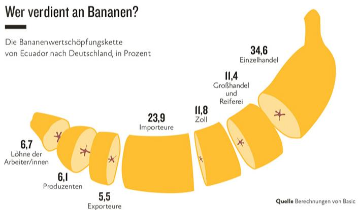

# Ziele, Zielkonflikte und Logistikkosten {#sec-logistikkosten}

```{r}
#| label: ch3-setup
#| message: false
#| warning: false

# Tidyverse: dplyr (Datenmanipulation), ggplot2 (Grafiken), u.a.
library(tidyverse)
# kableExtra: formatierte HTML-/PDF-Tabellen (kbl(), kable_styling())
library(kableExtra)

# Farbpalette und Hilfsfunktionen des Kurses einbinden (Objekt `cols`)
source("../R/scm_functions.R")
```

::: {.lernziele}
**Lernziele**

- Sie können das Zielsystem der Logistik und des Supply Chain Managements benennen und die zentralen Zielgrößen (Kosten, Zeit, Zuverlässigkeit, Flexibilität/Resilienz, Qualität, Information) unterscheiden.
- Sie können erklären, warum diese Ziele in einem Spannungsfeld zueinanderstehen, und das "Tetraeder der Zielkonflikte" sowie Zielprofile interpretieren.
- Sie können die wichtigsten Logistikkostenarten (Transport-, Lager-, Bestands-, Handling-, Fehlmengenkosten u. a.) unterscheiden und an Beispielen quantifizieren.
- Sie können typische Abwägungsentscheidungen der Logistik (Transportmittel, Lageranzahl, Sicherheitsbestand, Losgröße) anhand gegenläufiger Kostenkurven analysieren.
- Sie können den R-Pipe-Operator `|>`, `dplyr::group_by()`/`summarise()` zur Aggregation sowie formatierte Tabellen mit `kableExtra` einsetzen, um Kostendaten auszuwerten und darzustellen.
:::

## Von der Strategie zur operativen Steuerung

Im vorangegangenen Kapitel stand die strategische Ebene im Vordergrund: Welche Wertschöpfungsstufen übernimmt ein Unternehmen selbst, welche werden ausgelagert, und wie muss die Supply Chain gestaltet sein, damit sie zur Wettbewerbsstrategie passt (*Strategic Fit*)? Diese strategischen Weichenstellungen legen den Rahmen fest, innerhalb dessen Logistik und Supply Chain Management operativ handeln. Damit stellt sich die Anschlussfrage: Woran genau wird der Erfolg dieses operativen Handelns gemessen? Mit welchen Zielgrößen arbeitet das SCM, und was kostet es, diese Ziele zu erreichen?

Dieses Kapitel führt das **Zielsystem** der Logistik und des Supply Chain Managements ein, zeigt anhand eines anschaulichen "Tetraeders" die unausweichlichen **Zielkonflikte** zwischen Kosten, Geschwindigkeit, Qualität, Flexibilität sowie Nachhaltigkeit und arbeitet die wichtigsten **Logistikkostenarten** heraus. Abschließend wird an mehreren Zahlenbeispielen — von der Bananenwertschöpfungskette bis zum Apple iPod — gezeigt, wie sich Logistikkosten in der Praxis zusammensetzen und wie man sie mit R systematisch auswertet.

## Ziele des Supply-Chain-Managements

Supply-Chain-Management gestaltet Material-, Informations- und Finanzflüsse über Unternehmensgrenzen hinweg. Jede Gestaltungsentscheidung — etwa über Standorte, Bestände, Transportmittel, Kapazitäten oder Lieferanten — beeinflusst mehrere Zielgrößen gleichzeitig. Ein Netzwerk mit niedrigen Kosten kann lange Lieferwege verursachen. Hohe Lieferbereitschaft kann Sicherheitsbestände erhöhen. Eine starke Zentralisierung kann Bestände und Abschreibungen verringern, zugleich aber Entfernungen zu Kundinnen und Kunden vergrößern.

Eine fundierte Entscheidung erfordert daher mehr als die Frage, welche Alternative die geringsten unmittelbaren Kosten auslöst. Sie verlangt eine transparente Bewertung wirtschaftlicher, leistungsbezogener, risiko- und umweltbezogener Wirkungen. Dieses Kapitel entwickelt dafür die Begriffe und Modellierungslogiken, auf die die folgenden Kapitel zur Standortplanung, Unsicherheit und Bestandssteuerung aufbauen.

## Zielsysteme in Unternehmen: eine Verortung

Bevor wir uns den logistikspezifischen Zielen zuwenden, lohnt ein kurzer Blick auf die Struktur betrieblicher Zielsysteme insgesamt. In jedem Unternehmen existiert ein hierarchisch gegliedertes Managementsystem: Auf der **normativen Ebene** werden grundsätzliche Werte, die Unternehmensverfassung und die -kultur festgelegt; auf der **strategischen Ebene** werden langfristige Erfolgspotenziale aufgebaut (dies war der Gegenstand von Kapitel [-@sec-strategic-fit]); auf der **operativen Ebene** schließlich werden die Tagesgeschäfte so gesteuert, dass die strategischen Vorgaben erfüllt werden [@dyckhoff1998grundzuege].

Jeder dieser Ebenen sind eigene Ziele zugeordnet — von sehr allgemeinen, langfristigen Leitbildern bis zu sehr konkreten, kurzfristig messbaren Kennzahlen. Logistik- und SCM-Ziele sind typischerweise auf der strategischen bis operativen Ebene angesiedelt: Sie leiten sich aus übergeordneten Unternehmenszielen (z. B. Rentabilität, Wachstum, Kundenzufriedenheit) ab, sind aber konkret genug, um im Tagesgeschäft als Entscheidungskriterium zu dienen.

Diese Einordnung ist mehr als eine akademische Fingerübung: Sie erklärt, warum Logistikentscheidungen fast nie "im luftleeren Raum" getroffen werden. Eine Entscheidung über die Anzahl der Auslieferungslager etwa ist eine operative bis strategische Entscheidung, die aber nur dann sinnvoll ist, wenn sie zur übergeordneten Servicestrategie des Unternehmens passt. Wer sich auf der strategischen Ebene für eine Kostenführerschaft entschieden hat (vgl. Kapitel [-@sec-strategic-fit]), wird auf der operativen Ebene tendenziell andere Ziel-Anspruchsniveaus setzen als ein Unternehmen, das auf Differenzierung durch Schnelligkeit setzt. Das Zielsystem der Logistik ist also kein Selbstzweck, sondern die operative "Übersetzung" der Wettbewerbsstrategie in messbare Größen.

::: {.definition}
**Definition: Ziel**

Ein **Ziel** beschreibt einen angestrebten zukünftigen Zustand, der durch eine **Zielgröße** (das *Was*, z. B. "Lieferzeit"), ein **Anspruchsniveau** (das *Wie viel*, z. B. "maximal 24 Stunden") und einen **zeitlichen Bezug** (das *Bis wann*) charakterisiert ist. Ziele dienen als Maßstab, an dem Entscheidungsalternativen bewertet und Zielerreichungsgrade gemessen werden.
:::

### Wirtschaftlichkeit

Wirtschaftlichkeit bedeutet, die zur Leistungserstellung eingesetzten Ressourcen effizient zu nutzen. In Supply Chains umfasst dies insbesondere Beschaffungs-, Produktions-, Lager-, Transport-, Umschlag-, Informations- und Koordinationskosten. Entscheidend sind nicht isolierte Einzelkosten, sondern die Kosten des gesamten Systems. Eine Maßnahme, die lokale Transportkosten senkt, kann beispielsweise an anderer Stelle höhere Bestände, längere Durchlaufzeiten oder schlechtere Servicewerte verursachen.

Die Perspektive der Gesamtkosten wird häufig als *Total-Cost-of-Ownership*- oder *Total-Logistics-Cost*-Denken bezeichnet. Sie verlangt, dass Entscheidungen entlang der gesamten Kette bewertet werden und nicht nur aus Sicht einer einzelnen Funktion oder eines einzelnen Unternehmens.

### Service und Zeit

Logistikleistung zeigt sich für Kundinnen und Kunden vor allem in Verfügbarkeit, Lieferzeit, Lieferzuverlässigkeit, Flexibilität und Informationsqualität. Typische Kennzahlen sind der Lieferbereitschaftsgrad, die vollständige und pünktliche Lieferung sowie die mittlere Durchlaufzeit.

Ein hohes Serviceniveau ist meist nicht kostenlos erreichbar. Kürzere Lieferzeiten benötigen häufig mehr Lagerstandorte, zusätzliche Kapazitäten, höhere Sicherheitsbestände oder schnellere Transportmodi. Die zentrale betriebswirtschaftliche Aufgabe besteht darin, das gewünschte Leistungsniveau explizit zu bestimmen und die dafür erforderlichen Ressourcen sichtbar zu machen.

### Resilienz und Risiko

Supply Chains sind Störungen ausgesetzt, etwa durch Nachfrageschwankungen, Ausfälle von Lieferanten, Kapazitätsengpässe, Naturereignisse oder infrastrukturelle Unterbrechungen. Resilienz beschreibt die Fähigkeit eines Netzwerks, solche Störungen zu absorbieren, sich anzupassen und seine Leistungsfähigkeit wiederherzustellen.

Resilienz kann durch Redundanzen, alternative Bezugsquellen, flexible Kapazitäten, regionale Diversifikation, Transparenz und geeignete Sicherheitsbestände verbessert werden. Solche Maßnahmen erhöhen häufig die unmittelbaren Kosten. Sie können jedoch wirtschaftlich sinnvoll sein, wenn sie erwartete Störungskosten, Umsatzausfälle oder Reputationsschäden vermindern.

### Nachhaltigkeit

Nachhaltigkeit erweitert das Zielsystem um ökologische und soziale Wirkungen. Im Mittelpunkt dieses Kapitels stehen zunächst ökologische Wirkungen logistischer Entscheidungen: Treibhausgasemissionen, Energie- und Ressourcenverbrauch, Flächeninanspruchnahme, Luftschadstoffe, Abfall und Verderb. Soziale Aspekte — etwa Arbeitsbedingungen, Sicherheit und regionale Wertschöpfung — sind ebenfalls relevant, werden hier aber nicht in ein einheitliches quantitatives Maß überführt.

Nachhaltigkeit ist kein isoliertes Zusatzkriterium. Sie verändert, wie Standorte, Transportwege, Bestände, Verpackungen, Produktionsmengen und Beschaffungsstrukturen bewertet werden. In vielen Supply Chains entstehen wesentliche Umweltwirkungen nicht im eigenen Betrieb, sondern bei Vorlieferanten, Transportdienstleistern oder in der Nutzungs- und Rücknahmephase von Produkten.


## Zielmetriken in Logistik und Supply Chain Management

Traditionell wird die Leistungsfähigkeit von Logistik und Supply Chain Management anhand einer überschaubaren Menge von **Zielmetriken** beurteilt. Sechs Größen tauchen in nahezu jedem Logistik-Lehrbuch auf und bilden gemeinsam ein Rad, dessen Speichen sich gegenseitig beeinflussen:

- **Lieferzeit**: die Zeitspanne zwischen Auftragserteilung durch den Kunden und der tatsächlichen Erfüllung des Auftrags (Wareneingang beim Kunden). Kurze Lieferzeiten erhöhen die Kundenzufriedenheit, verlangen aber häufig höhere Bestände oder teurere Transportmittel.
- **Liefertreue**: das Verhältnis zwischen zugesagtem und tatsächlich realisiertem Liefertermin. Eine hohe Liefertreue bedeutet, dass Zusagen verlässlich eingehalten werden — unabhängig davon, wie lang die zugesagte Frist ist.
- **Lieferqualität**: der Anteil der Aufträge, die sowohl mengenmäßig als auch qualitativ korrekt ausgeführt wurden (keine Falsch- oder Fehllieferungen, keine Transportschäden).
- **Flexibilität/Resilienz**: die Fähigkeit, kurzfristige Änderungen bei Mengen, Terminen oder Produktspezifikationen zu realisieren bzw. sich von Störungen (Lieferengpässen, Nachfrageschocks) schnell zu erholen.
- **Information**: die Qualität und Transparenz der Information, die während der gesamten Auftragsabwicklung verfügbar ist — etwa Sendungsverfolgung oder verlässliche Bestandsdaten.
- **Kosten**: die Effizienz, mit der all diese Leistungen erbracht werden, gemessen an den Gesamtkosten der logistischen Aktivitäten.

Diese sechs Zielgrößen sind nicht unabhängig voneinander. Im Gegenteil: Ihr Zusammenspiel — genauer gesagt ihr *Widerspruch* — ist der eigentliche Kern des Logistikmanagements, wie der folgende Abschnitt zeigt.

Neben diesen "klassischen" ökonomischen Zielgrößen rücken in den letzten Jahren zunehmend **ökologische und soziale Ziele** in den Vordergrund: die Reduktion von Treibhausgasemissionen entlang der Kette, der schonende Umgang mit Ressourcen oder die Einhaltung sozialer Mindeststandards bei Zulieferern. Diese Ziele treten nicht additiv neben das bestehende Zielsystem, sondern verschärfen die bereits bestehenden Zielkonflikte zusätzlich — eine emissionsärmere Bahnverbindung ist oft langsamer als der Lkw-Transport, ein regionaler statt globaler Zulieferer kann teurer, aber ökologisch vorteilhafter sein. Eine vollständige Behandlung dieser dritten und vierten Zieldimension würde den Rahmen dieses Kapitels sprengen; sie sei aber als Ausblick festgehalten und findet sich vertiefend bei @dyckhoff2008nachhaltige.


## Das Spannungsfeld der Logistikziele: Zieldimensionen und das Tetraeder

Würde man jede der sechs Zielgrößen unabhängig maximieren bzw. minimieren wollen, entstünde ein Logistiksystem mit perfekter Lieferzeit, perfekter Liefertreue, perfekter Qualität, maximaler Flexibilität, voller Transparenz — zu minimalen Kosten. Ein solches System existiert nicht. Jede Verbesserung einer Zielgröße geht in aller Regel zulasten mindestens einer anderen. Man spricht hier von einem **Zielkonflikt**.

::: {.definition}
**Definition: Zielkonflikt**

Ein **Zielkonflikt** liegt vor, wenn die Verbesserung einer Zielgröße (z. B. kürzere Lieferzeit) notwendigerweise die Verschlechterung mindestens einer anderen Zielgröße (z. B. höhere Kosten) nach sich zieht. Zielkonflikte lassen sich nicht "auflösen", sondern nur durch eine bewusste Abwägung — einen **Trade-off** — handhaben.
:::

::: {.vertiefung}
**Theorie-Vertiefung: Zielbeziehungen und Pareto-Effizienz**

Die betriebswirtschaftliche Entscheidungstheorie unterscheidet drei Arten von Beziehungen zwischen zwei Zielen [@dyckhoff1998grundzuege]: **Komplementäre** Ziele fördern sich gegenseitig (eine bessere Lieferqualität senkt z. B. Reklamations- und damit Logistikkosten), **indifferente** Ziele beeinflussen sich nicht, und **konkurrierende** Ziele stehen im Konflikt. Wichtig ist, dass die Art der Beziehung nicht "naturgegeben" ist, sondern vom betrachteten Bereich der Alternativen abhängt: Solange ein Logistiksystem Verschwendung enthält (etwa Leerfahrten oder doppelt gehaltene Bestände), lassen sich Kosten und Lieferzeit oft **gleichzeitig** verbessern — die Ziele verhalten sich in diesem Bereich komplementär. Erst wenn alle solchen Verbesserungen ausgeschöpft sind, wird die Beziehung konkurrierend.

Formal nennt man eine Alternative **Pareto-effizient** (oder dominanzfrei), wenn es keine andere zulässige Alternative gibt, die in mindestens einem Ziel besser und in keinem Ziel schlechter ist. Die Menge aller Pareto-effizienten Alternativen bildet die **Effizienzgrenze** — dieselbe Denkfigur, die in Kapitel [-@sec-strategic-fit] als Kosten-Reaktionsfähigkeits-Grenze eingeführt wurde. Echte Zielkonflikte existieren nur *auf* dieser Grenze. Daraus folgen zwei Managementaufgaben, die man sauber trennen sollte: Erstens ein ineffizientes System an die Grenze heranzuführen (hier gibt es keinen Zielkonflikt, nur Verbesserungspotenzial), und zweitens auf der Grenze eine Position zu wählen, die zur Wettbewerbsstrategie passt (hier ist eine Abwägung unvermeidlich). Die Zielprofile weiter unten sind im Grunde nichts anderes als unterschiedliche Positionen auf einer solchen mehrdimensionalen Effizienzgrenze.
:::

Zur Veranschaulichung reduziert man das Zielsystem häufig auf vier zentrale, stark verdichtete Dimensionen: **Qualität**, **Geschwindigkeit**, **Kosten** und **Flexibilität/Resilienz**. Stellt man diese vier Dimensionen als die vier Eckpunkte eines Tetraeders (einer dreiseitigen Pyramide) dar, wird das Spannungsfeld unmittelbar sichtbar: Jede Kante des Tetraeders verbindet zwei Zielgrößen, zwischen denen abgewogen werden muss, und kein reales Logistiksystem kann gleichzeitig in allen vier Ecken "perfekt" positioniert sein.

```{r}
#| label: ch3-tetraeder
#| fig-cap: "Das Tetraeder der Zielkonflikte: Qualität, Geschwindigkeit, Kosten und Flexibilität/Resilienz stehen in einem gegenseitigen Spannungsfeld."
#| fig-alt: "Dreidimensionale Pyramide (Tetraeder) mit den vier Eckpunkten Qualität, Geschwindigkeit, Kosten und Flexibilität/Resilienz."

library(plotly)

# Vier Eckpunkte des Tetraeders: 1-3 bilden die Grundfläche, 4 die Spitze
eckpunkte <- data.frame(
  ziel = c("Qualität", "Geschwindigkeit", "Kosten", "Flexibilität / Resilienz"),
  x = c(-3.8, 0.0, 3.8, 0.0),
  y = c(-2.2, 3.2, -2.2, 0.0),
  z = c(0.0, 0.0, 0.0, 4.2)
)

# Vier Dreiecksflächen: Grundfläche (0,1,2) sowie drei Seitenflächen zur Spitze (3)
flaechen_i <- c(0, 0, 0, 1)
flaechen_j <- c(1, 2, 3, 2)
flaechen_k <- c(2, 3, 1, 3)

# Aufbau der 3D-Grafik mit plotly: Flächen (mesh3d), Kanten (Linien), Beschriftungen
fig_tetraeder <- plot_ly() |>
  add_trace(
    type = "mesh3d",
    x = eckpunkte$x, y = eckpunkte$y, z = eckpunkte$z,
    i = flaechen_i, j = flaechen_j, k = flaechen_k,
    intensity = c(0.20, 0.55, 0.85, 1.00),
    colors = c(cols$mid, cols$atp, cols$strat, cols$top),
    opacity = 0.78, flatshading = TRUE, showscale = FALSE,
    hoverinfo = "skip"
  ) |>
  add_trace(
    type = "scatter3d", mode = "markers+text",
    x = eckpunkte$x, y = eckpunkte$y, z = eckpunkte$z,
    text = eckpunkte$ziel,
    textposition = "top center",
    marker = list(size = 6, color = cols$border),
    textfont = list(size = 13, color = cols$text),
    hovertemplate = "%{text}<extra></extra>",
    showlegend = FALSE
  ) |>
  layout(
    scene = list(
      xaxis = list(visible = FALSE), yaxis = list(visible = FALSE),
      zaxis = list(visible = FALSE), bgcolor = "white"
    ),
    paper_bgcolor = "white",
    margin = list(l = 0, r = 0, b = 0, t = 0)
  )

fig_tetraeder
```

Konkrete Logistiksysteme lassen sich dann als **Zielprofile** innerhalb dieses Spannungsfelds charakterisieren. Ein Express-Kurierdienst positioniert sich z. B. nahe an der Ecke "Geschwindigkeit" — zulasten der Kosten. Ein auf Kosteneffizienz getrimmter Seefracht-Massentransport liegt dagegen nahe der Ecke "Kosten" — zulasten der Lieferzeit. Ein Zulieferer in einer Just-in-Sequence-Fertigung wiederum muss auf der Kante zwischen Flexibilität und Geschwindigkeit operieren, da er auf kurzfristige Abrufänderungen reagieren *und* dennoch termingenau liefern muss.

Statt der vier verdichteten Dimensionen lassen sich auch die vier Ursprungsgrößen **Lieferzeit**, **Lieferzuverlässigkeit**, **Lieferflexibilität** und **Logistikkosten** in einem sogenannten **Zielprofil-Diagramm** (auch Radar- oder Spinnendiagramm) abbilden. Jede Achse repräsentiert eine Zielgröße; ein konkretes System wird durch ein Polygon dargestellt, dessen Eckpunkte den erreichten Ausprägungen entsprechen. Vergleicht man mehrere Systeme (oder Systemalternativen) auf diese Weise, werden Unterschiede in der strategischen Positionierung sofort sichtbar — ein System mit einem "spitzen", einseitig ausgerichteten Profil verfolgt eine klare Fokus-Strategie, während ein ausgeglicheneres Profil auf einen Kompromiss zwischen den Zielen setzt.

```{r}
#| label: ch3-zielprofile
#| fig-cap: "Zielprofile: vier Logistiksysteme mit unterschiedlicher Positionierung zwischen kurzen Lieferzeiten, hoher Lieferzuverlässigkeit, großer Lieferflexibilität und niedrigen Logistikkosten."
#| fig-alt: "Radardiagramm mit vier Achsen (Lieferzeit, Lieferzuverlässigkeit, Lieferflexibilität, Logistikkosten) und vier eingezeichneten Zielprofilen."

library(plotly)

# Vier Zielgrößen auf einer Skala von 0 bis 10; jedes Profil ein Polygon.
# Die erste Achse wird am Ende wiederholt, damit sich das Polygon schließt.
achsen <- c("kurze Lieferzeit", "hohe Lieferzuverlässigkeit",
            "große Lieferflexibilität", "niedrige Logistikkosten")

zielprofile <- tibble::tribble(
  ~profil,    ~lieferzeit, ~zuverlaessigkeit, ~flexibilitaet, ~kosten,
  "Profil 1",         5.8,               8.7,            5.8,     1.8,
  "Profil 2",         7.6,               3.2,            8.6,     3.2,
  "Profil 3",         9.3,               4.9,            1.5,     5.0,
  "Profil 4",         3.6,               1.5,            3.6,     8.2
)

# Radardiagramm mit plotly (scatterpolar): eine Spur je Zielprofil
fig_zielprofile <- plot_ly(type = "scatterpolar", fill = "toself")

for (i in seq_len(nrow(zielprofile))) {
  werte <- as.numeric(zielprofile[i, -1])
  fig_zielprofile <- fig_zielprofile |>
    add_trace(
      r = c(werte, werte[1]),               # erste Achse wiederholen -> Polygon schließt sich
      theta = c(achsen, achsen[1]),
      name = zielprofile$profil[i],
      opacity = 0.35
    )
}

fig_zielprofile <- fig_zielprofile |>
  layout(
    polar = list(radialaxis = list(visible = TRUE, range = c(0, 10))),
    paper_bgcolor = "white"
  )

fig_zielprofile
```

Beide Darstellungen — Tetraeder und Zielprofil — transportieren dieselbe Botschaft: Logistik- und SCM-Entscheidungen sind fast immer **Abwägungsentscheidungen**. Es geht nicht darum, "das beste" System schlechthin zu finden, sondern dasjenige Zielprofil zu wählen, das am besten zur übergeordneten Wettbewerbsstrategie passt — eine unmittelbare Fortsetzung des in Kapitel [-@sec-strategic-fit] behandelten Strategic-Fit-Gedankens [@chopra2025supply].

::: {.r-exkurs}
**R-Exkurs: Der Pipe-Operator `|>`**

In den bisherigen Kapiteln haben Sie einzelne R-Befehle meist nacheinander in getrennten Zeilen notiert oder Funktionsaufrufe ineinander verschachtelt. Bei mehrstufigen Datenverarbeitungen — "Nimm die Daten, filtere sie, gruppiere sie, fasse sie zusammen, sortiere sie" — wird eine Verschachtelung schnell unübersichtlich. Der **Pipe-Operator** `|>` (gesprochen "dann") löst dieses Problem: Er nimmt das Ergebnis auf seiner linken Seite und übergibt es als *erstes* Argument an die Funktion auf seiner rechten Seite.

```{r}
#| label: ch3-pipe-demo

# Ohne Pipe: Funktionsaufrufe werden von innen nach außen verschachtelt
kosten <- c(120, 340, 95, 410, 180)
round(mean(sort(kosten, decreasing = TRUE)), 1)

# Mit Pipe: dieselbe Berechnung, aber in der Reihenfolge lesbar,
# in der sie gedanklich abläuft ("nimm kosten, dann sortiere, dann...")
kosten |>
  sort(decreasing = TRUE) |>
  mean() |>
  round(1)
```

Der Pipe-Operator verändert *nicht*, was berechnet wird — nur, wie leicht der Rechenweg nachvollziehbar ist. Ab jetzt werden wir ihn durchgängig verwenden, insbesondere in Verbindung mit den `dplyr`-Funktionen `filter()`, `mutate()`, `group_by()` und `summarise()`, die Sie in Kapitel [-@sec-strategic-fit] bereits kennengelernt haben bzw. im Folgenden kennenlernen. Eine Pipe-Kette liest sich dann fast wie ein Satz: *"Nimm die Kostendaten, gruppiere sie nach Kostenart, und fasse sie zu Summen zusammen."*
:::


## Logistikkosten als Entscheidungsgrundlage

Die Kostenperspektive verdient eine genauere Betrachtung, weil sie in praktisch jeder Zielabwägung als "Gegenspieler" zu Zeit, Qualität und Flexibilität auftritt. In vielen Teilbereichen der Logistik stehen sich zwei (oder mehr) Kostenkomponenten gegenüber, die sich mit derselben Entscheidungsvariable *gegenläufig* verhalten: Steigt die eine Kostenart, sinkt die andere — und umgekehrt. Weil beide Effekte gleichzeitig wirken, ergibt sich für die **Gesamtkosten** eine u-förmige Kurve mit einem (zumindest theoretischen) Kostenminimum.

Formal lässt sich ein solcher Zusammenhang häufig durch eine Kostenfunktion der Form

$$
K(x) = \underbrace{a \cdot x^2}_{\text{steigende Kostenart}} + \underbrace{\frac{b}{x}}_{\text{fallende Kostenart}}, \qquad x > 0
$$

beschreiben, wobei $x$ die Entscheidungsvariable (z. B. Sicherheitsbestand, Losgröße, Anzahl Lager) und $a, b > 0$ Kostenparameter sind. Das Minimum dieser Funktion ergibt sich durch Nullsetzen der ersten Ableitung:

$$
K'(x) = 2a x - \frac{b}{x^2} \stackrel{!}{=} 0 \quad \Longrightarrow \quad x^* = \left(\frac{b}{2a}\right)^{1/3}
$$

Dieses Muster — eine steigende und eine fallende Kostenkomponente, deren Summe ein Minimum besitzt — begegnet uns in der Logistik in immer wieder ähnlicher Form. Wichtig ist dabei die Interpretation der Parameter $a$ und $b$: Sie sind keine willkürlichen Konstanten, sondern bilden reale Kostensätze ab (z. B. Zinssatz und Lagerkostensatz je Einheit für $a$, Rüst- oder Fehlmengenkostensatz für $b$) und müssten in der Praxis aus der Kostenrechnung geschätzt werden. Je nach Entscheidungssituation ändert sich außerdem, *welche* Kostenart steigt und welche fällt — das mathematische Grundmuster bleibt aber dasselbe. Vier typische Beispiele:

1. **Wahl des Transportmittels**: Schnellere Transportmittel (Flugzeug) verursachen höhere direkte Transportkosten, senken aber die Kosten der Kapitalbindung im Bestand (kürzere Transportzeit $\rightarrow$ weniger Bestand unterwegs). Langsamere Transportmittel (Schiff, Bahn) sind günstiger je Mengeneinheit, binden aber länger Kapital in Beständen.
2. **Anzahl der Lager**: Mehr Lagerstandorte erhöhen die Kosten der Lagerhaltung und -versorgung (mehr Fixkosten, mehr Sicherheitsbestände), senken aber die Transportkosten der Auslieferung an die Kunden (kürzere "letzte Meile").
3. **Höhe des Sicherheitsbestands**: Ein höherer Sicherheitsbestand erhöht die Lagerkosten (Kapitalbindung, Lagerplatz), senkt aber die erwarteten Fehlmengenkosten (Umsatzverlust, Konventionalstrafen, Image-Schäden bei Lieferausfällen).
4. **Losgröße**: Größere Bestellmengen bzw. Fertigungslose erhöhen die Lagerkosten (mehr durchschnittlicher Bestand), senken aber die Rüst- bzw. Bestellkosten (weniger Bestellvorgänge/Rüstwechsel je Periode).

```{r}
#| label: ch3-tradeoff-plot
#| fig-cap: "Grundmuster einer logistischen Abwägungsentscheidung: Zwei gegenläufige Kostenkomponenten ergeben in der Summe eine u-förmige Gesamtkostenkurve mit einem Kostenminimum."
#| fig-alt: "Liniendiagramm mit drei Kurven: einer fallenden, einer steigenden und der u-förmigen Summenkurve mit Minimum."

# Entscheidungsvariable x (z.B. Sicherheitsbestand, Losgröße, Lageranzahl)
x <- seq(1, 5, length.out = 200)

# Zwei gegenläufige Kostenkomponenten
kosten_a <- 0.1 * x^2   # z.B. Lager-/Bestandskosten: steigen mit x
kosten_b <- 1 / x       # z.B. Fehlmengen-/Rüst-/Transportkosten: fallen mit x
kosten_gesamt <- kosten_a + kosten_b

tradeoff_df <- tibble(
  x = x, Lagerkosten = kosten_a, Gegenkosten = kosten_b, Gesamtkosten = kosten_gesamt
) |>
  pivot_longer(-x, names_to = "kostenart", values_to = "kosten")

ggplot(tradeoff_df, aes(x = x, y = kosten, color = kostenart, linewidth = kostenart)) +
  geom_line() +
  scale_color_manual(values = c(
    Lagerkosten = cols$mid, Gegenkosten = cols$atp, Gesamtkosten = cols$border
  )) +
  scale_linewidth_manual(values = c(Lagerkosten = 0.8, Gegenkosten = 0.8, Gesamtkosten = 1.3)) +
  labs(
    x = "Entscheidungsvariable (z. B. Sicherheitsbestand, Losgröße, Lageranzahl)",
    y = "Kosten", color = "Kostenkomponente", linewidth = "Kostenkomponente"
  ) +
  theme_minimal()
```

So anschaulich dieses Grundmuster ist, in der Praxis bleibt es oft nur eine Annäherung. Die tatsächliche **Transparenz der Kostenfunktionen** ist häufig stark eingeschränkt, und zwar aus mehreren Gründen:

- **Datenverfügbarkeit**: Viele Kostenkomponenten (insbesondere Fehlmengenkosten) sind schwer zu beobachten, weil entgangene Umsätze oder Imageschäden nicht direkt in der Buchhaltung erscheinen.
- **Intertemporale Zurechenbarkeit**: Investitionsentscheidungen (z. B. Bau eines neuen Lagers) wirken über mehrere Perioden; welcher Anteil der Kosten welcher Periode "zuzurechnen" ist, ist eine normative, keine rein technische Frage.
- **Kostenträgerschaft**: In komplexen Supply Chains mit mehreren Akteuren ist oft unklar, wer welche Kosten letztlich trägt — der Hersteller, der Logistikdienstleister oder der Handel.
- **Stochastizität**: Nachfrage-, Durchlaufzeit- und Störungsrisiken sind zufallsbehaftet; Kostenfunktionen, die auf Erwartungswerten basieren, verdecken die Streuung um diesen Erwartungswert.

Trotz dieser Einschränkungen ist das Grundmuster "zwei gegenläufige Kostenkomponenten, ein Optimum" ein zentrales Denkwerkzeug des Logistikmanagements. Es wird uns in den folgenden Kapiteln in konkreterer, formalisierter Form wiederbegegnen — etwa bei der Bestimmung der optimalen Bestellmenge (EOQ-Modell) oder bei der Wahl des optimalen Sicherheitsbestands unter Nachfrageunsicherheit.

::: {.r-exkurs}
**R-Exkurs: Vektorisierte Kostenberechnungen**

R ist von Grund auf **vektorisiert**: Rechenoperationen wirken automatisch auf jedes Element eines Vektors, ohne dass eine explizite Schleife (`for`) nötig wäre. Das ist besonders praktisch, wenn Gesamtkosten aus mehreren Kostenkomponenten zusammengesetzt werden sollen, die jeweils für unterschiedliche Perioden, Standorte oder Produkte vorliegen.

```{r}
#| label: ch3-vektor-kosten

# Monatliche Kostenkomponenten eines Lagerstandorts (in Tsd. EUR)
transportkosten <- c(42, 38, 45, 51, 47, 39)
lagerkosten     <- c(18, 19, 17, 20, 21, 18)
fehlmengenkosten <- c(3, 1, 6, 2, 0, 4)

# Gesamtkosten je Monat: elementweise Summe der drei Vektoren --
# R addiert automatisch Element 1 mit Element 1, Element 2 mit Element 2 usw.
gesamtkosten <- transportkosten + lagerkosten + fehlmengenkosten
gesamtkosten

# Anteil der Fehlmengenkosten an den Gesamtkosten je Monat, in Prozent
fehlmengenkosten / gesamtkosten * 100

# Kennzahlen über alle sechs Monate hinweg
c(
  Summe = sum(gesamtkosten),
  Mittelwert = mean(gesamtkosten),
  Maximum = max(gesamtkosten)
)
```

Ohne Vektorisierung müsste man für jede dieser Berechnungen eine Schleife über die sechs Monate schreiben. Da R Vektoroperationen "elementweise" ausführt, genügt ein einziger Ausdruck — kürzer, lesbarer und weniger fehleranfällig.
:::

## Logistikkostenarten im Überblick

Nachdem das Grundmuster der Abwägung geklärt ist, lohnt sich ein systematischerer Blick auf die **Logistikkosten** selbst.

::: {.definition}
**Definition: Logistikkosten**

**Logistikkosten** sind der bewertete Verzehr von Sachgütern und Dienstleistungen zum Zweck der Erbringung logistischer Leistungen — also aller Aktivitäten, die Güter in der richtigen Menge, Qualität, am richtigen Ort und zur richtigen Zeit verfügbar machen [@schulte2001material].
:::

In der Literatur und Praxis hat sich eine grobe Einteilung in fünf bis sechs Hauptkategorien etabliert, die sich unmittelbar aus den im vorangegangenen Abschnitt diskutierten Abwägungsentscheidungen ergeben:

- **Transportkosten**: Kosten für den physischen Transport von Gütern zwischen zwei Punkten der Supply Chain — abhängig von Transportmittel, Entfernung, transportierter Menge und gewünschter Geschwindigkeit. Sie umfassen sowohl die eigentlichen Frachtkosten als auch Kosten für Umschlag und Vor-/Nachlauf.
- **Lager-/Handlingkosten**: Kosten für Lagerhaltung im engeren Sinne (Miete oder kalkulatorische Abschreibung der Lagerfläche, Energie, Personal für Ein-, Aus- und Umlagerung) sowie für Kommissionierung und innerbetrieblichen Transport. Diese Kosten steigen in aller Regel mit der Anzahl der Lagerstandorte und mit dem durchschnittlich vorgehaltenen Bestand.
- **Bestandskosten** (auch: Kapitalbindungskosten): Kosten, die durch das im Bestand gebundene Kapital entstehen — kalkulatorische Zinsen auf das gebundene Kapital, Versicherung, Wertminderung/Obsoleszenz sowie Schwund. Sie werden häufig als Prozentsatz des durchschnittlichen Bestandswerts angegeben (typische Größenordnungen: 15–30 % p. a.).
- **Fehlmengenkosten**: Kosten, die entstehen, wenn Nachfrage nicht (rechtzeitig) bedient werden kann — entgangener Deckungsbeitrag, Konventionalstrafen, Eilbeschaffungskosten für Ersatzlieferungen sowie langfristige Reputationsschäden, die sich in zukünftig entgangenen Aufträgen niederschlagen können. Fehlmengenkosten sind besonders schwer zu quantifizieren, weil ein Teil davon (Imageverlust) sich erst mit erheblicher Verzögerung zeigt.
- **Rüst-/Bestellkosten**: fixe, mengenunabhängige Kosten je Bestell- oder Rüstvorgang (Personal- und Verwaltungsaufwand für die Bestellabwicklung bzw. Maschinenumrüstung bei der Fertigung). Sie fallen unabhängig von der bestellten oder gefertigten Menge in gleicher Höhe an — ein Grund, warum größere, seltenere Lose diese Kostenart pro Stück senken.
- **Verpackungs- und Informationskosten**: Kosten für Verpackungsmaterial (inkl. Schutz- und Ladungssicherung) sowie für die informationstechnische Abwicklung der Auftragsabwicklung (Auftragserfassung, Sendungsverfolgung, EDI-Schnittstellen zu Kunden und Lieferanten).

Diese Kostenarten korrespondieren eng mit den vier Abwägungsbeispielen aus dem letzten Abschnitt: Transportmittelwahl betrifft primär Transport- vs. Bestandskosten, die Lageranzahl betrifft Lager- vs. Transportkosten, der Sicherheitsbestand betrifft Bestands- vs. Fehlmengenkosten, und die Losgröße betrifft Lager- vs. Rüstkosten. Ein zentrales Anliegen des Supply Chain Costing (Kostenrechnung entlang der gesamten Kette) ist es, diese Kostenarten nicht isoliert je Unternehmen, sondern **kettenübergreifend** zu betrachten — denn eine lokale Kostenoptimierung bei einem Akteur kann an anderer Stelle der Kette zu höheren Kosten führen [@guenther2012produktion; @thonemann2023operations].

## Beispiel: Wertschöpfung und Logistikkosten in der Bananenkette

Wie stark Logistik- und Handelsspannen den Endpreis eines Produkts prägen können, zeigt die Wertschöpfungskette der Banane von Ecuador nach Deutschland (@fig-bananenkette). Von jedem Euro, den Konsumentinnen und Konsumenten im deutschen Einzelhandel für eine Banane bezahlen, verbleiben nur rund 6,1 % bei den Produzent:innen und 6,7 % als Löhne der Arbeiter:innen vor Ort — während Importeure (23,9 %) und der Einzelhandel (34,6 %) den größten Teil der Marge vereinnahmen.

{#fig-bananenkette}

Diese Verteilung lässt sich in R nachbilden und systematisch auswerten — ein guter Anlass, zwei zentrale `dplyr`-Werkzeuge einzuführen: `group_by()` und `summarise()`.

::: {.r-exkurs}
**R-Exkurs: Aggregation mit `group_by()` und `summarise()`**

Häufig liegen Kostendaten in einer "langen" Tabelle vor — eine Zeile je Einzelposition — und man möchte sie nach einem Merkmal **gruppieren** und je Gruppe eine Kennzahl (Summe, Mittelwert, Anzahl, …) berechnen. Genau das leisten `dplyr::group_by()` und `dplyr::summarise()` im Zusammenspiel:

1. `group_by(spalte)` teilt den Datensatz gedanklich in Untergruppen anhand der Ausprägungen von `spalte`.
2. `summarise(neue_spalte = funktion(...))` berechnet für **jede Gruppe** eine oder mehrere zusammenfassende Kennzahlen und liefert eine neue, kompaktere Tabelle zurück — eine Zeile je Gruppe.

```{r}
#| label: ch3-bananen-gruppieren

# Wertschöpfungskette der Banane: Anteil je Akteur am Endpreis (in Prozent)
bananenkette <- tibble::tribble(
  ~akteur,                    ~kategorie,        ~anteil_prozent,
  "Löhne der Arbeiter/innen", "Produktionsland",             6.7,
  "Produzenten",              "Produktionsland",             6.1,
  "Exporteure",               "Produktionsland",             5.5,
  "Importeure",                "Handel",                    23.9,
  "Zoll",                      "Handel",                    11.8,
  "Großhandel und Reiferei",  "Handel",                     11.4,
  "Einzelhandel",              "Handel",                    34.6
)

# Pipe + group_by + summarise: "Nimm die Bananenkette, gruppiere nach
# Kategorie, und summiere je Kategorie den Anteil am Endpreis."
bananenkette |>
  group_by(kategorie) |>
  summarise(
    anteil_gesamt = sum(anteil_prozent),
    anzahl_akteure = n()
  )
```

Das Ergebnis macht die zentrale Botschaft der Grafik in einer Zahl greifbar: Nur rund 18,3 % des Endpreises verbleiben im Produktionsland (bei drei Akteuren), während 81,7 % auf Handel, Zoll und Distribution im Zielland entfallen (bei vier Akteuren). `group_by()`/`summarise()` funktioniert nach demselben Prinzip auch für Logistikkosten: Gruppiert man z. B. nach Kostenart (Transport, Lager, Bestand, Fehlmengen) statt nach Kette-Kategorie, erhält man auf identische Weise eine Kostenartenübersicht — eine Auswertung, die in jeder Logistik-Controlling-Abteilung routinemäßig anfällt.
:::

## Formatierte Tabellen: das Beispiel Logistikkostenanteile

Rohtabellen wie im letzten R-Exkurs sind für die interaktive Analyse praktisch, für die Präsentation in einem Bericht oder einer Präsentation aber oft zu schlicht. Das Paket `kableExtra` erlaubt es, Tabellen mit wenigen zusätzlichen Befehlen professionell zu formatieren.

Als Anwendungsbeispiel dient eine Gegenüberstellung des Anteils der Logistikkosten (LK) am Verkaufspreis für fünf sehr unterschiedliche Produkte — von der in Bangladesch gefertigten Jeans bis zum in China montierten, per Luftfracht verschifften Mobiltelefon.

::: {.r-exkurs}
**R-Exkurs: Formatierte Tabellen mit `kableExtra`**

`kableExtra` baut auf `knitr::kable()` auf und ergänzt es um Styling-Optionen. Der typische Arbeitsablauf ist: Daten mit `dplyr` aufbereiten $\rightarrow$ mit `kbl()` (kurz für "kable") in eine Tabelle verwandeln $\rightarrow$ mit `kable_styling()` formatieren.

```{r}
#| label: ch3-kableextra-demo

# Logistikkostenanteile ausgewählter Produkte (Daten grob nach
# praxisnahen Kalkulationsbeispielen, gerundet)
produktkosten <- tibble::tribble(
  ~produkt,          ~verkaufspreis_eur, ~direkte_lk_eur, ~indirekte_lk_eur,
  "Jeans",                        12.92,            1.89,              3.19,
  "Bluse",                       129.30,            2.77,             16.81,
  "Ford Focus",                12932.03,         1175.00,            106.00,
  "el. Zahnbürste",              112.07,            8.19,              7.08,
  "Mobiltelefon",                120.69,            5.95,              9.03
)

# Logistikkosten insgesamt und deren Anteil am Verkaufspreis berechnen
produktkosten <- produktkosten |>
  mutate(
    lk_gesamt_eur = direkte_lk_eur + indirekte_lk_eur,
    lk_anteil_prozent = round(lk_gesamt_eur / verkaufspreis_eur * 100, 1)
  )

# Formatierte Tabelle: kbl() erzeugt die Tabelle, kable_styling()
# formatiert sie (u.a. gestreifte Zeilen, kompakte Breite)
produktkosten |>
  select(Produkt = produkt, `Preis (€)` = verkaufspreis_eur,
         `LK gesamt (€)` = lk_gesamt_eur, `LK-Anteil (%)` = lk_anteil_prozent) |>
  kbl(digits = 2, caption = "Logistikkostenanteile ausgewählter Produkte") |>
  kable_styling(bootstrap_options = c("striped", "hover", "condensed"),
                full_width = FALSE)
```
:::

Die Tabelle zeigt eine bemerkenswerte Spannweite: Während beim Ford Focus die Logistikkosten mit rund 9,9 % des Verkaufspreises verhältnismäßig gering ausfallen (weil der Fahrzeugpreis selbst sehr hoch ist), machen sie bei der vergleichsweise günstigen Jeans knapp 40 % des Verkaufspreises aus. Der Grund liegt im **Verhältnis von Produktwert zu Transportaufwand**: Eine Jeans wird über weite Strecken per Seefracht transportiert und ist trotzdem ein "Low-Value"-Produkt, sodass die (in absoluten Zahlen kleinen) Logistikkosten einen großen Anteil am ebenfalls kleinen Verkaufspreis ausmachen. Beim Auto verhält es sich umgekehrt: Auch wenn absolut hohe Logistikkosten anfallen (globales Sourcing, mehrere Transportstufen), ist der Fahrzeugwert so hoch, dass der prozentuale Anteil gering bleibt. Diese Beobachtung ist ein wichtiges Prinzip für die Praxis: **Die Bedeutung der Logistikkosten hängt maßgeblich vom Wert-Gewicht- bzw. Wert-Volumen-Verhältnis eines Produkts ab** — ein Zusammenhang, der auch die Standortentscheidungen im nächsten Kapitel mitbestimmt.

## Supply Chain Costing: das Beispiel Apple iPod

Ein besonders anschauliches Fallbeispiel für **Supply Chain Costing** — also die Analyse der Kosten- und Wertschöpfungsverteilung entlang einer gesamten, global verteilten Kette — liefert der Video-iPod (30 GB) von Apple, wie er in der Studie von Dedrick, Kraemer und Linden [@dedrick2012usitc] rekonstruiert wurde.

Die Wertschöpfungskette umfasst vier Prozessstufen: **Beschaffung**, **Produktion**, **Distribution** und **Absatz**. Komponenten wie Festplatte und Display kommen aus Japan, Speicherchips aus Korea, Prozessor und Flash-Speicher aus den USA, weitere Teile (u. a. Akku) aus anderen Ländern. Die Endmontage findet in China statt, Distribution und Handel laufen über die USA, bevor das Produkt bei US-amerikanischen Endkund:innen ankommt.

Die Kostenstruktur lässt sich wie folgt zusammenfassen: Die eingekauften Komponenten summieren sich auf 97 + 3 + 16 + 24 = 140 US-Dollar. Die Montage in China kostet zusätzlich 4 US-Dollar, und für Distribution und Einzelhandel in den USA fallen rund 75 US-Dollar an. Zusammen ergeben sich 140 + 4 + 75 = 219 US-Dollar, die in der Studie als "Herstellungskosten" aus Sicht von Apple ausgewiesen werden — der Begriff ist hier also weit gefasst und umfasst die gesamte Kette bis zum Regal. Bei einem Verkaufspreis von 299 US-Dollar verbleibt Apple ein Deckungsbeitrag von absolut 80 US-Dollar bzw. relativ rund 26 % des Verkaufspreises.

```{r}
#| label: ch3-ipod-kostenrechnung

# Kostenpositionen des Apple Video iPod (30 GB), in US-Dollar
ipod_kosten <- c(
  Komponenten_Japan  = 97,
  Komponenten_Korea  =  3,
  Komponenten_USA    = 16,
  Komponenten_Sonstige = 24,
  Montage_China      =  4,
  Distribution_Handel = 75
)

# Vektorisierte Summenbildung: Herstellungskosten insgesamt
herstellungskosten <- sum(ipod_kosten)
herstellungskosten

verkaufspreis <- 299
deckungsbeitrag_abs <- verkaufspreis - herstellungskosten
deckungsbeitrag_rel <- deckungsbeitrag_abs / verkaufspreis * 100

# Übersicht der Kennzahlen
tibble::tibble(
  Herstellungskosten = herstellungskosten,
  Verkaufspreis = verkaufspreis,
  Deckungsbeitrag_absolut = deckungsbeitrag_abs,
  Deckungsbeitrag_relativ_Prozent = round(deckungsbeitrag_rel, 1)
) |>
  kbl(digits = 1, caption = "Kostenrechnung Apple Video iPod (30 GB)") |>
  kable_styling(bootstrap_options = c("striped", "condensed"), full_width = FALSE)
```

Bemerkenswert an diesem Beispiel ist, dass die Distributions- und Handelskosten (75 US-Dollar) fast so hoch sind wie *alle* Komponentenkosten zusammen (140 US-Dollar) und die reine Endmontage in China mit 4 US-Dollar nur einen minimalen Anteil ausmacht. Dieses Muster ist typisch für globale Elektronik-Supply-Chains: Der größte Teil der Wertschöpfung — und ein erheblicher Teil der Kosten — entsteht nicht in der Fertigung selbst, sondern in Beschaffung, Distribution und Handel. Genau hier setzt Supply Chain Management an: Es geht nicht darum, isoliert einzelne Fertigungsschritte zu optimieren, sondern die Kosten- und Wertschöpfungsstruktur der *gesamten* Kette zu verstehen und zu steuern [@chopra2025supply; @tripp2024distributions].


## Nachhaltigkeit als Zielgröße logistischer Entscheidungen

### Ökologische Wirkungen logistischer Aktivitäten

Logistische Aktivitäten verursachen Umweltwirkungen entlang des gesamten Produktlebenszyklus. Zu den besonders relevanten Quellen gehören:

- Transporte durch Kraftstoff- oder Energieverbrauch sowie durch zurückgelegte Distanzen
- Lager und Umschlag durch Heizung, Kühlung, Beleuchtung, Fördertechnik und Flächennutzung
- Verpackungen durch Materialeinsatz, Schutzwirkung, Gewicht und Rücknahmefähigkeit
- Bestände durch Verderb, Obsoleszenz, Abschreibungen und Entsorgung
- Produktions- und Beschaffungsentscheidungen durch ihre Wirkungen bei vorgelagerten Lieferanten

Für eine erste operative Bewertung werden Treibhausgasemissionen häufig als CO₂-Äquivalente ausgedrückt. Dieses Maß erleichtert Vergleiche, ersetzt jedoch keine vollständige Umweltbilanz. Beispielsweise können Flächenverbrauch, Wasserknappheit, Biodiversität oder lokale Luftschadstoffe bei derselben Entscheidung ebenfalls relevant sein.

### Von externen Effekten zu entscheidungsrelevanten Kosten

Ein externer Effekt liegt vor, wenn eine Aktivität Dritte belastet oder begünstigt, ohne dass diese Wirkung vollständig im Marktpreis der Entscheidung enthalten ist. Emissionen, Lärm oder lokale Luftschadstoffe sind typische negative externe Effekte logistischer Aktivitäten.

Für betriebliche Entscheidungen können solche Wirkungen auf unterschiedliche Weise berücksichtigt werden:

- durch gesetzliche Preise, Abgaben oder handelbare Zertifikate
- durch interne CO₂-Preise und Investitionsregeln
- durch Emissionsbudgets oder unternehmensinterne Reduktionsziele
- durch Kundenanforderungen, Ausschreibungen und Lieferantenstandards
- durch Berichtspflichten sowie Reputations- und Marktrisiken

Die Internalisierung bedeutet nicht, dass für jede Umweltwirkung ein zweifelsfreier Marktpreis existiert. Sie bedeutet zunächst, Umweltwirkungen in der Entscheidung sichtbar zu machen und eine nachvollziehbare Regel festzulegen, wie sie gegenüber Kosten und Service gewichtet oder begrenzt werden.

### Kosten, Service und Emissionen als Zielkonflikt

Sei \(x\) ein Vektor logistischer Entscheidungsvariablen, beispielsweise über Lagerstandorte, Transportmengen, Lieferwege oder Bestandsniveaus. Die Gesamtkosten werden mit \(K(x)\), die Treibhausgasemissionen mit \(E(x)\) bezeichnet. Dann lautet eine mehrzielige Darstellung:

$$
\min \; \left(K(x), E(x)\right).
$$

Ein solches Problem besitzt im Allgemeinen nicht nur eine eindeutig beste Lösung. Eine Verbesserung der Kosten kann mit höheren Emissionen verbunden sein und umgekehrt. Als effizient oder Pareto-optimal gelten Lösungen, bei denen keine Zielgröße verbessert werden kann, ohne mindestens eine andere Zielgröße zu verschlechtern.

Das Serviceniveau kann als drittes Ziel oder als Mindestanforderung modelliert werden. Beispielsweise kann verlangt werden, dass ein Anteil von mindestens \(\alpha\) der Nachfrage innerhalb einer vorgegebenen Zeit beliefert wird. In dieser Form wird klar: Nachhaltige Gestaltung bedeutet nicht automatisch, Kosten oder Service zu vernachlässigen, sondern Zielgrößen transparent gemeinsam zu steuern.

### Mehrzielentscheidungen und CO₂-Preise

Eine Möglichkeit, Kosten und Emissionen in einer Zielfunktion zusammenzuführen, ist die gewichtete Bewertung:

$$
\min \; Z(x) = K(x) + \lambda E(x).
$$

Der Parameter \(\lambda\) beschreibt, mit welchem Betrag eine zusätzliche Emissionseinheit bewertet wird. Er kann einen gesetzlichen Preis, einen internen Lenkungspreis oder eine analytische Gewichtung darstellen. Steigt \(\lambda\), gewinnen emissionsärmere Alternativen relativ an Attraktivität.

Die Methode ist leicht anzuwenden, erfordert aber eine sorgfältige Interpretation. Ein bestimmter Wert von \(\lambda\) ist keine naturwissenschaftlich vorgegebene Wahrheit, sondern Ausdruck einer Regel, Präferenz oder institutionellen Rahmenbedingung. Deshalb sollten Ergebnisse für mehrere plausible Werte analysiert werden.

### CO₂-Budgets und Nebenbedingungen

Eine zweite Möglichkeit besteht darin, die Emissionen zu begrenzen und innerhalb dieses Budgets die Kosten zu minimieren:

$$
\begin{aligned}
\min \quad & K(x) \\
\text{unter der Nebenbedingung} \quad & E(x) \leq \bar{E}, \\
& x \in X.
\end{aligned}
$$

Dabei bezeichnet \(\bar{E}\) ein Emissionsbudget und \(X\) die Menge aller technisch und organisatorisch zulässigen Entscheidungen. Diese Formulierung passt besonders gut zu unternehmensinternen Reduktionszielen, regulatorischen Obergrenzen oder verbindlichen Nachhaltigkeitsvorgaben.

Ist das Budget sehr großzügig, entspricht die Lösung häufig dem reinen Kostenminimum. Wird es schrittweise verschärft, steigen die minimal erreichbaren Kosten typischerweise an. Die Differenz zwischen den optimalen Kosten bei zwei Budgets macht den ökonomischen Aufwand zusätzlicher Emissionsminderung sichtbar.

### Beispiel: Liefernetz mit Kosten- und Emissionszielen

Ein Unternehmen beliefert Kundengebiete aus mehreren potenziellen Lagern. Jedes eröffnete Lager verursacht fixe Kosten. Transporte verursachen je nach Entfernung, Fahrzeugtyp, Auslastung und Energiequelle sowohl Kosten als auch Emissionen.

Eine kostenminimale Lösung kann wenige zentrale Lager bevorzugen, weil sie Fixkosten und Bestände bündelt. Eine emissionsminimale Lösung kann dagegen andere Standorte wählen, wenn dadurch Transportwege verkürzt, alternative Verkehrsträger erreichbar oder energieeffizientere Lager genutzt werden. Eine dritte Lösung minimiert Kosten unter einem verbindlichen Emissionsbudget.

Die Standort- und Netzwerkmodelle der folgenden Kapitel erweitern genau diese Logik. Dort werden fixe Standortkosten, Transportmengen, Kapazitäten und Zuordnungen als formale Entscheidungsvariablen modelliert.

## Kennzahlen und Entscheidungsprozess

### Geeignete Kennzahlen

Kennzahlen verdichten komplexe Wirkungen, dürfen aber nicht zu falscher Sicherheit führen. Für Supply-Chain-Entscheidungen sind unter anderem relevant:

- Gesamtkosten und Kosten je Einheit
- Lieferbereitschaft, Lieferzeit und Lieferzuverlässigkeit
- Bestandsreichweite, Umschlagshäufigkeit und Abschreibungen
- Transportleistung und Emissionen je Sendung, Einheit oder Tonnenkilometer
- Energieverbrauch und Anteil erneuerbarer Energien
- Abfall-, Retouren- und Verwertungsquoten
- Störungsdauer, Wiederanlaufzeit und Anteil alternativer Bezugsquellen

Kennzahlen sollten stets mit klaren Bilanzgrenzen, Bezugsgrößen und Zeiträumen dokumentiert werden. Eine Emission pro Einheit kann sich verbessern, obwohl die absoluten Emissionen aufgrund steigender Mengen zunehmen. Beide Perspektiven sind daher erforderlich.

### Systematisches Vorgehen

Ein belastbarer Entscheidungsprozess umfasst typischerweise fünf Schritte:

1. Entscheidung und Systemgrenze definieren: Welche Produkte, Standorte, Stufen und Zeiträume gehören zur Analyse?
2. Zielgrößen und Mindestanforderungen bestimmen: Welche Kosten-, Service-, Risiko- und Umweltgrößen sind entscheidungsrelevant?
3. Alternativen und Daten aufbereiten: Welche Distanzen, Mengen, Kapazitäten, Kosten- und Emissionsfaktoren werden benötigt?
4. Modelle und Szenarien auswerten: Wie verändern sich Ergebnisse bei anderen CO₂-Preisen, Budgets, Nachfragewerten oder Servicevorgaben?
5. Entscheidung begründen und überwachen: Welche Zielkonflikte werden akzeptiert, welche Kennzahlen werden später kontrolliert?

Die explizite Dokumentation von Annahmen ist besonders wichtig. Sie macht Entscheidungen nachvollziehbar und erlaubt, Modellresultate bei veränderten Rahmenbedingungen zu aktualisieren.

## Fallstudie SushiFresh GmbH: Geschäftsidee und strategische Analyse {#sec-sushifresh-intro}

Zum Abschluss der Grundlagenkapitel wird das Fallbeispiel eingeführt, das uns durch den gesamten weiteren Reader begleitet. Es erlaubt, die bisher eingeführten Konzepte — Wertschöpfungsprozess, Strategic Fit, Zielsystem und Zielkonflikte — auf ein konkretes, überschaubares Geschäftsmodell anzuwenden, bevor in den folgenden Kapiteln die quantitativen Planungsmodelle an demselben Unternehmen durchgerechnet werden.

::: {.fallstudie}
**Fallstudie: Die Geschäftsidee der SushiFresh GmbH**

Die **SushiFresh GmbH** ist ein (fiktives) Start-up, das **täglich frisch hergestellte Sushi-Boxen** im Rhein-Main-Gebiet anbietet.

- **Versprechen:** "Heute gefertigt, heute verkauft" — Sushi in Restaurantqualität, aber ohne Wartezeit.
- **Produktion:** eine zentrale Küche, Fertigung in den frühen Morgenstunden.
- **Absatzkanal:** Supermärkte (Regalverkauf im Kühlregal).
- **Sortiment:** ca. 12 Boxen (klassisch, vegetarisch, vegan).

*Eckdaten:* Haltbarkeit maximal 24–36 Stunden; durchgehende Kühlkette von 0–4 °C; Zutaten Reis, Nori, regionales Gemüse sowie importierter Lachs und Thunfisch; stark schwankende Nachfrage (Wochentag, Wetter, Events); geplantes Wachstum von 3 auf 30 Verkaufsstellen.
:::

Die Vorlesung stellt zu dieser Geschäftsidee zwei Gruppen von Leitfragen: zur **strategischen Position** und zur **Struktur der Supply Chain**. Im Folgenden wird eine mögliche Analyse skizziert, die die Begriffe der Kapitel [-@sec-einfuehrung] bis [-@sec-logistikkosten] systematisch anwendet. Sie ist nicht als einzig richtige Lösung zu verstehen, sondern als Beispiel für eine strukturierte Argumentation.

### Strategische Position

**Kundengruppen und Nutzenversprechen.** SushiFresh adressiert Kundinnen und Kunden, die eine schnelle, hochwertige Mahlzeit suchen — Berufstätige in der Mittagspause, Pendler, Kleinhaushalte am Abend. Im Sinne der Nutzenarten aus Kapitel [-@sec-einfuehrung] steht nicht allein der Formnutzen (das Produkt), sondern vor allem der **Zeitnutzen** (sofort verfügbar, ohne Wartezeit) und der **Raumnutzen** (im ohnehin besuchten Supermarkt) im Vordergrund. Die Frische ist dabei das zentrale Qualitätsmerkmal. Gegenüber Restaurants und Lieferdiensten punktet SushiFresh mit Bequemlichkeit und Preis, gegenüber industriell gefertigtem, länger haltbarem Supermarkt-Sushi mit Qualität und Frische. Wettbewerbsstrategisch entspricht dies am ehesten einer **Qualitäts- bzw. Serviceführerschaft** (vgl. die Normstrategien in Kapitel [-@sec-strategic-fit]) — nicht einer Kostenführerschaft.

**Implizierte Unsicherheit und Strategic Fit.** Nach der Systematik aus Kapitel [-@sec-strategic-fit] ist die implizierte Unsicherheit hoch: Die Tagesnachfrage schwankt mit Wochentag, Wetter und Events; das Sortiment umfasst zwölf Varianten, deren Einzelnachfrage schwerer zu prognostizieren ist als die Gesamtnachfrage; der Kunde erwartet sofortige Verfügbarkeit (Lieferzeit null); und die Zahl der Verkaufsstellen soll stark wachsen. Hinzu kommt eine Besonderheit des Produkts: Wegen der Haltbarkeit von maximal 36 Stunden lässt sich Unsicherheit **nicht über Fertigwarenbestände** über mehrere Tage puffern. Das Produkt verhält sich damit ähnlich wie Fishers "innovative" Produkte, obwohl es sich um ein Lebensmittel handelt. Strategic Fit verlangt deshalb eine eher **reaktionsfähige** Supply Chain — allerdings mit einer Einschränkung: Die Reaktionsfähigkeit kann nicht über Lagerbestände fertiger Boxen, sondern nur über **flexible Produktionsmengen**, **kurze Durchlaufzeiten** und **gute Prognosen** hergestellt werden.

**Zielkonflikte.** Übertragen auf das Tetraeder dieses Kapitels treten vor allem drei Konflikte auf. *Frische versus Kosten:* Tägliche Produktion und Auslieferung verhindern große Lose und volle Lkw-Auslastung. *Verfügbarkeit versus Ausschuss:* Jede zusätzliche Box, die zur Absicherung gegen leere Regale produziert wird, erhöht das Risiko, am Abend unverkaufte Ware abschreiben zu müssen — genau der Zielkonflikt, den das Newsvendor-Modell in Kapitel [-@sec-newsvendor] optimiert. *Service versus Umwelt:* Häufige, kleine Kühltransporte und Lebensmittelabfälle belasten die Ökobilanz (vgl. Kapitel [-@sec-nachhaltigkeit]). Strategisch besonders wichtig sind damit die Zielgrößen **Lieferqualität** (Frische, Kühlkette), **Liefertreue** (Ware muss vor Ladenöffnung im Regal sein) und **Verfügbarkeit**; die Logistikkosten sind nachrangig, dürfen aber die Marge nicht aufzehren.

### Struktur der Supply Chain

**Stufen und Partner.** Die Kette umfasst die Lieferanten (Fischgroßhandel für Lachs und Thunfisch, regionaler Gemüsehandel, Reis- und Nori-Lieferanten), die zentrale Küche von SushiFresh, die Kühllogistik zu den Filialen sowie den Lebensmitteleinzelhandel als Absatzkanal. Der Fisch ist dabei die kritische Komponente: Er ist teuer, verderblich und wird importiert, sodass Beschaffungsmenge und -zeitpunkt eng mit der Produktionsplanung abgestimmt werden müssen (vgl. den Bullwhip-Effekt in Kapitel [-@sec-bullwhip]).

**Umgang mit Nachfrageschwankungen und Frische.** Da Fertigwaren nicht gelagert werden können, liegt der Entkopplungspunkt (Kapitel [-@sec-strategic-fit]) *vor* der Endmontage der Boxen: Vorgehalten werden allenfalls Rohwaren und vorbereitete Komponenten (gekochter Reis, geschnittenes Gemüse, portionierter Fisch), während die Boxen selbst täglich auf Basis einer Tagesprognose gefertigt werden. Die Kühlkette muss lückenlos dokumentiert werden, was für eine enge Anbindung der Logistik an SushiFresh spricht.

**Zentralität versus Dezentralität.** Eine zentrale Küche nutzt Skaleneffekte, bündelt Know-how und Qualitätskontrolle und erlaubt — wie Kapitel [-@sec-unsicherheit-pooling] zeigen wird — erhebliche Einsparungen durch **Pooling** der Nachfrageunsicherheit. Dem stehen längere Transportwege, ein höheres Ausfallrisiko (ein Standort) und frühere Produktionszeitpunkte gegenüber. Mehrere kleine, filialnahe Küchen wären reaktionsfähiger, aber teurer. Wo genau Produktionsstandorte liegen sollten und wie viele es sein sollten, ist Gegenstand der Kapitel [-@sec-standort-1] und 5.

**Wertschöpfungstiefe.** Die Kernkompetenz liegt in der Rezeptur, der Produktion und der Frischegarantie — diese Stufen gehören in eigene Hand (*Make*). Bei der Kühllogistik ist eine Make-or-Buy-Abwägung im Sinne von Kapitel [-@sec-strategic-fit] nötig: Ein spezialisierter Dienstleister bietet Skaleneffekte und variable statt fixer Kosten, eine eigene Flotte dagegen Kontrolle über Zeitfenster und Kühlkette — ein Argument, das angesichts des Frischeversprechens und der engen Anlieferzeit vor Ladenöffnung schwer wiegt. Beim Fischeinkauf spricht die Volatilität der Rohwarenpreise und -verfügbarkeit für langfristige Rahmenverträge mit wenigen, zuverlässigen Großhändlern.

### Wie die Fallstudie im Reader weitergeht

Die folgenden Kapitel greifen jeweils eine der hier aufgeworfenen Fragen auf und beantworten sie quantitativ:

| Kapitel | Fragestellung für SushiFresh | Methode |
|:---|:---|:---|
| [-@sec-nachhaltigkeit] | Welche ökologischen Zielkonflikte (Kühlkette, Lebensmittelabfall) entstehen? | Nachhaltigkeitsstrategien, Circular SCM |
| [-@sec-standort-1] | Welcher von drei Kandidatenstandorten eignet sich für die Produktion? Wo läge der transportkostenminimale Punkt? | Nutzwertanalyse, AHP, Center of Gravity, Weiszfeld |
| [-@sec-standort-2] | Welche Standorte sollten eröffnet und welche Filialen von wo beliefert werden? | Warehouse Location Problem, Add-/Drop-Heuristik |
| [-@sec-unsicherheit-pooling] | Wie viel Sicherheitsbestand spart eine zentrale Versorgung gegenüber einer dezentralen? | Kapazitäts- und Lagerbestandspooling |
| [-@sec-newsvendor] | Wie viele Boxen sollen jeden Morgen für eine Filiale produziert werden? | Newsvendor-Modell |
| [-@sec-bullwhip] | Wie schaukeln sich Bestellschwankungen zwischen Filialen, SushiFresh und Fischgroßhändler auf? | Bullwhip-Effekt, Order-up-to-Politik |

## Zusammenfassung

Dieses Kapitel hat das Zielsystem der Logistik und des Supply Chain Managements eingeführt: Lieferzeit, Liefertreue, Lieferqualität, Flexibilität/Resilienz, Information und Kosten bilden gemeinsam den Rahmen, an dem logistische Entscheidungen gemessen werden. Da sich diese Ziele nicht unabhängig voneinander optimieren lassen, entstehen unvermeidliche **Zielkonflikte**, die sich anschaulich als "Tetraeder" zwischen Qualität, Geschwindigkeit, Kosten und Flexibilität/Resilienz sowie als individuelle Zielprofile darstellen lassen. Konkret wird dieses Spannungsfeld bei typischen logistischen Abwägungsentscheidungen — Transportmittelwahl, Lageranzahl, Sicherheitsbestand, Losgröße —, bei denen jeweils zwei gegenläufige Kostenkomponenten eine u-förmige Gesamtkostenkurve mit einem (theoretischen) Minimum ergeben.

Auf der Kostenseite wurden die wichtigsten **Logistikkostenarten** (Transport-, Lager-, Bestands-, Fehlmengen-, Rüst-/Bestellkosten) unterschieden und an drei Beispielen — der Bananenwertschöpfungskette, einem Produktvergleich der Logistikkostenanteile sowie der Kostenrechnung des Apple iPod — quantitativ veranschaulicht. Dabei wurde deutlich, dass die Bedeutung der Logistikkosten stark vom Wert-Gewicht-Verhältnis eines Produkts abhängt und dass ein sinnvolles Kostenmanagement die gesamte Supply Chain, nicht nur einzelne Stufen, in den Blick nehmen muss.

Auf der R-Seite haben Sie vier neue Werkzeuge kennengelernt: den **Pipe-Operator** `|>` zur lesbaren Verkettung von Operationen, `dplyr::group_by()` und `summarise()` zur Aggregation von Daten nach Gruppen, **vektorisierte Berechnungen** zur eleganten Kombination mehrerer Kostenkomponenten sowie formatierte Tabellen mit `kableExtra`. Diese Werkzeuge werden Sie in den folgenden Kapiteln — insbesondere bei der Standortplanung und der Bestandsplanung unter Unsicherheit — regelmäßig wiederverwenden: Immer dann, wenn Rohdaten zunächst aufbereitet, nach einem Merkmal gruppiert, zu Kennzahlen verdichtet und anschließend präsentationsfähig aufbereitet werden müssen, ist die Kombination aus Pipe, `group_by()`/`summarise()` und `kableExtra` das Standardwerkzeug der angewandten Datenanalyse in R.

Inhaltlich bildet dieses Kapitel das Scharnier zwischen der strategischen Positionierung aus Kapitel [-@sec-strategic-fit] und den quantitativen Planungsmodellen der folgenden Kapitel: Das hier eingeführte Zielsystem und die Grundidee der Kostenabwägung ziehen sich als roter Faden durch das gesamte weitere Buch — sei es bei der Wahl von Lagerstandorten, bei der Bestimmung optimaler Bestellmengen oder bei der Festlegung von Sicherheitsbeständen unter Nachfrageunsicherheit.

Logistikkosten müssen systemisch erfasst werden. Relevante Kosten entstehen in Beschaffung, Transport, Umschlag, Lagerung, Fehlmengen, Rücknahme und Koordination. Für Nachhaltigkeitsentscheidungen ist es zusätzlich notwendig, Emissionen und andere Umweltwirkungen sichtbar zu machen.

Drei Modellierungslogiken sind besonders wichtig:

- Kosten- und Emissionsziele können getrennt als Mehrzielproblem formuliert werden.
- Ein CO₂-Preis oder Gewichtungsparameter kann Emissionen in eine gemeinsame Zielfunktion überführen.
- Ein Emissionsbudget kann als Nebenbedingung festgelegt werden, während die Kosten minimiert werden.

Mit der Fallstudie der SushiFresh GmbH wurde schließlich ein Geschäftsmodell eingeführt, an dem sich Strategic Fit und Zielkonflikte konkret zeigen: hohe implizierte Unsicherheit bei zugleich kaum lagerfähiger Ware, Zielkonflikte zwischen Frische, Verfügbarkeit, Kosten und Abfall sowie die Grundsatzfrage zentraler oder dezentraler Produktion. Die folgenden Kapitel wenden diese Ideen auf Standort- und Netzwerkentscheidungen an. Sie zeigen, wie räumliche Struktur, Kapazität, Transport und Service formal modelliert und unter erweiterten Zielsystemen bewertet werden können.


::: {.kontrollfragen}
**Kontrollfragen**

1. Nennen Sie die sechs traditionellen Zielgrößen der Logistik und erläutern Sie jeweils in einem Satz, was sie messen.
2. Was versteht man unter einem Zielkonflikt, und warum lässt er sich nicht "auflösen", sondern nur durch Abwägung handhaben?
3. Erläutern Sie anhand eines Beispiels den Zielkonflikt zwischen Lieferbereitschaft und Bestandskosten.
4. Erläutern Sie anhand des Tetraeders, weshalb ein Logistiksystem nicht gleichzeitig maximale Qualität, Geschwindigkeit, Flexibilität und minimale Kosten erreichen kann.
5. Skizzieren Sie für zwei der vier Beispiele "Transportmittel, Lageranzahl, Sicherheitsbestand, Losgröße" jeweils die beiden gegenläufigen Kostenkomponenten.
6. Warum ist die Transparenz realer Kostenfunktionen in der Logistik häufig eingeschränkt? Nennen Sie mindestens zwei Gründe.
7. Nennen Sie mindestens vier Logistikkostenarten und ordnen Sie diese den vier Abwägungsbeispielen aus Frage 5 zu.
8. Erläutern Sie am Beispiel der Bananenwertschöpfungskette, warum ein hoher Anteil des Endpreises nicht bei den Produzent:innen, sondern bei Handel und Distribution verbleibt.
9. Was zeigt das Apple-iPod-Beispiel über die Verteilung von Kosten und Wertschöpfung in globalen Supply Chains, und weshalb reicht eine isolierte Betrachtung einzelner Wertschöpfungsstufen nicht aus?
10. Unter welchen Bedingungen kann eine Zentralisierung gleichzeitig Kosten, Emissionen und Verderb reduzieren — und wann ist dies eher unwahrscheinlich?
11. Ordnen Sie die SushiFresh GmbH in das Raster aus implizierter Unsicherheit und Reaktionsfähigkeit ein. Warum kann das Unternehmen Reaktionsfähigkeit nicht über Fertigwarenbestände herstellen, und welche Hebel bleiben ihm?
12. Unterscheiden Sie komplementäre, indifferente und konkurrierende Zielbeziehungen. Warum treten echte Zielkonflikte nur auf der Effizienzgrenze auf?
:::


